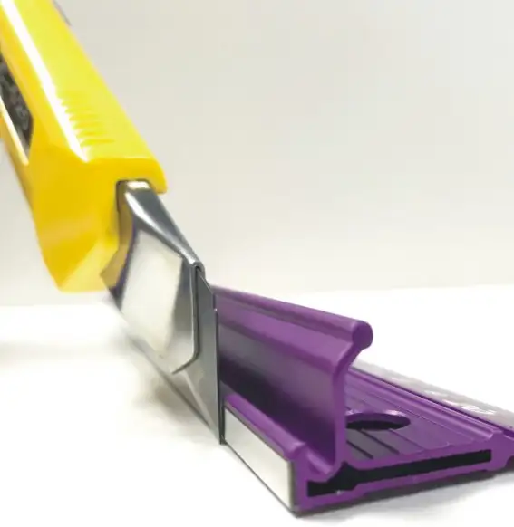
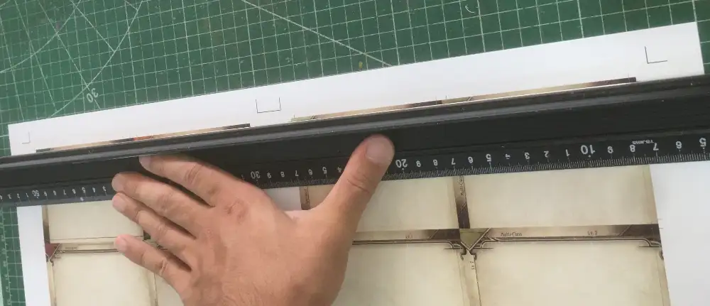
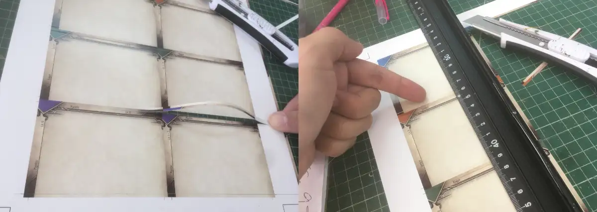
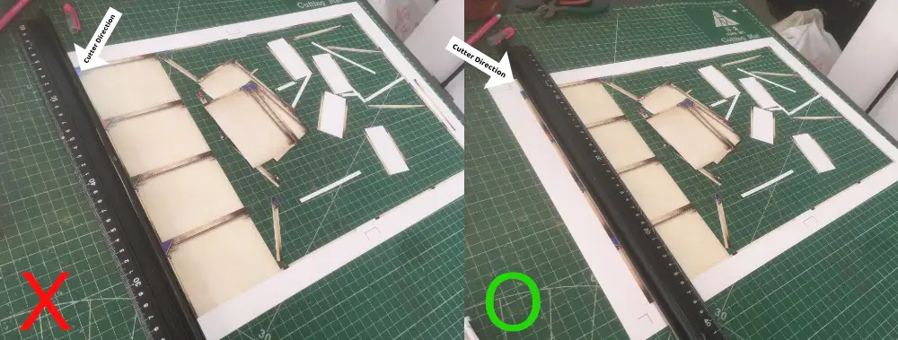

[Back to the main divider page.](/divider)

# Getting to know the hand cutter 

Real card cutting machine with its sharp punch exerting equal force at all points at once cut with an ideal angle perpendicularly to the paper. Cutter can't do that since ruler is perpendicular to the paper, cutter must be at a certain small angle. It is better if you can keep this angle as small as possible, like in this picture. Looks easy but in practice you may slowly drift out.

If cutter is too angled to the ruler, you may also create a visible chamfered edge on thick paper like this. Though this is not a problem after you sleeve the divider. If you are instead cutting print and play player cards with card back you want to blend with the rest of your deck then it matters, since it is possible to get so chamfered that you see white lines identifying the card.

Also you have to weight between two strategies :

- Making multiple, less-forceful cuts. This give you neat edges, but if the 2nd or 3rd time you didn't execute exactly the same angle of the knife to ruler, you might not land on exactly the same place. When this occurs, you may see visible waste of thin paper strips coming out.
- Making the fewest cuts possible with more force, but more force risks making some skips during the cut and this makes the edge fluff up.

Guillotine cutter fixes the ruler problem, since you don't need it the cutter can always land perpendicularly. But it also comes with its own problem such as high price to cover bigger paper, not portable, can't measure stuff unlike the ruler, and must cut edge to edge therefore you lose the cutting guide needed to perform cuts on the other side.

# Cutting mat's function

You must use a cutting mat. Do not cut on your glass table or floor tiles, even though you think cutter can't damage them, or even though you are ready to sacrifice cutter's sharpness. Cutting mat's main feature is not to protect your table or your cutter's sharpness (though those are indeed one of the issues).

Its actual critical feature is to allow the knife to go **beyond** the thickness of paper, like temporarily digging through the ground as you cut. As you lift up the knife, the wound closes and give you illusion that it could "self-heal". Even though it doesn't actually heal itself back, knife going through the work completely is required to get a clean cut. Now this is definitely what you prioritize over your table's surface or the cutter's durability.

In woodworking it is unthinkable that one would cut the work right on the table and expect to get a clean cut. They would instead clamp the work such that where they make the cut poke out from the workbench, so the saw can go through the work completely. Table saw also has a blade that is coming from a hole below. Using hand cutter with cutting mat is essentially a miniature version of that kind of thing.

# Ruler is a clamp

Good ruler makes straight cut, but great ruler **clamps** your work. It might not matter in thinner paper, but at 250~300 gsm, if ruler is not good enough on its contact with the paper and its length, it is possible for the cutter to dislocate the content you are cutting. If not immediately, it occurs later in the process since gripping area keeps getting smaller.

So getting a good ruler with big contact area and maybe anti-slip texture underneath is a must even if the price may surprised you.

A single slide ruin many adjacent cards on the sheet at once, and often even if one card is ruined, to make a replacement you can't easily remake just a single card and you ended up having to print a big sheet just to recover a few cards to make a complete set. Mistake like this is costly and you rather spend them on the ruler that you can keep using.

Make sure to distribute the weight well by pushing the paper near the center of mass of the remaining work to cut. Otherwise you might ended up creating a rotation point instead and ruin the cut anyway.

For "clamping" to work, you should make sure that both ends of the ruler are **on the cutting mat** and not entirely on the work. If the entire ruler is on the work, it could just skate on the work's slippery paper texture. This make ruler's length important in order to arch over the work, and price quicky shoot up for the ruler that is both good at gripping the work and long.

For example since the long edge of A4 is 29.7 cm, I don't think 30 cm ruler is enough to clamp it. I cut "A3 Plus" (also known as Super B size, a size designed so that you can trim the bleed back to get A3 poster with edge to edge art) so I need a 100 cm long ruler. If you only cut A4, get a 60 cm ruler minimum.

I don't know how international this ruler is, but I personally never seen any ruler better than Tajima's black ruler. (As pictured above.) In some place it is named a safety ruler, since it comes with a spot you can rest your thumb safely. This is not only important for safety, but when you feel like you can press down hard without worry about slipping to the cutter you clamps the work better.

I could find it on Amazon, so I think maybe it is also available near you?

# Avoid noodles

An uncut sheet with edge guides is designed to cut the center content out without cutting all the way to the edge. So you must either cut vertically first or horizontally first.

To decide which side to go first, choose the side with bigger gaps between cuts. If you choose a side with small gaps, when you go make a perpendicular cut you will have to fight what I called "noodles". It is harder to clamp down these noodles and increase the risk that your cutter sliding the noodles and cause collateral damage.

# Flip ruler on the last cut of each side

If you just slide ruler along the way, the last cut is where ruler has insufficient contact area to clamp the work. You must switch your cutting position to the other side to make the final cut to make sure the ruler can grip your work well. This gets easier if you work on a table where you can walk around the work. (Like at the corner of table.)
