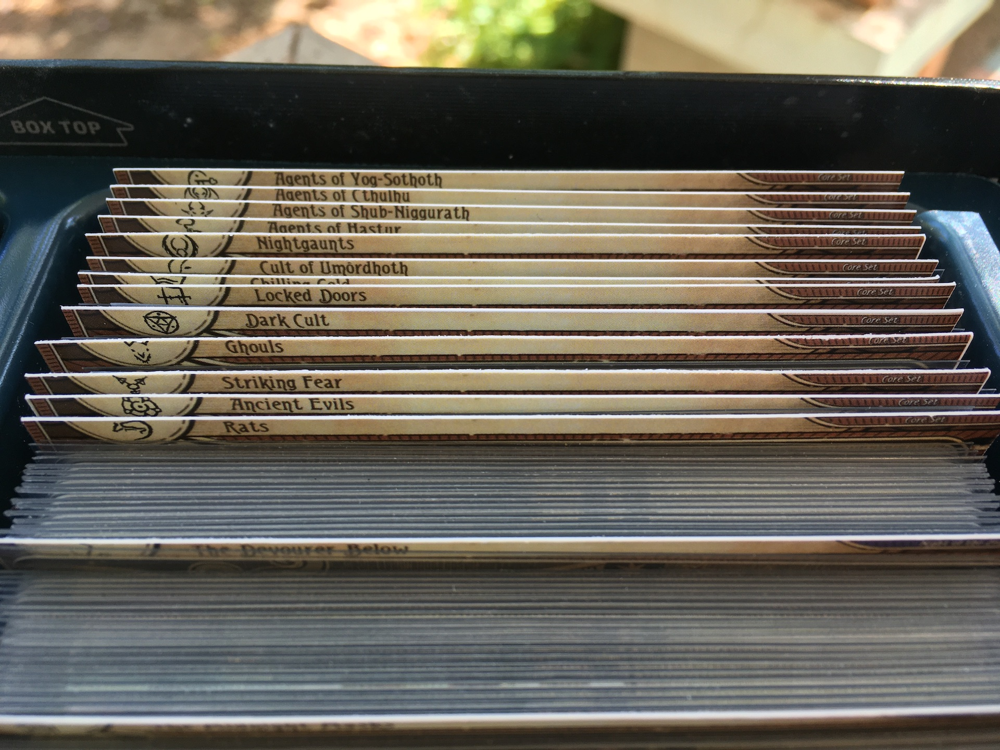
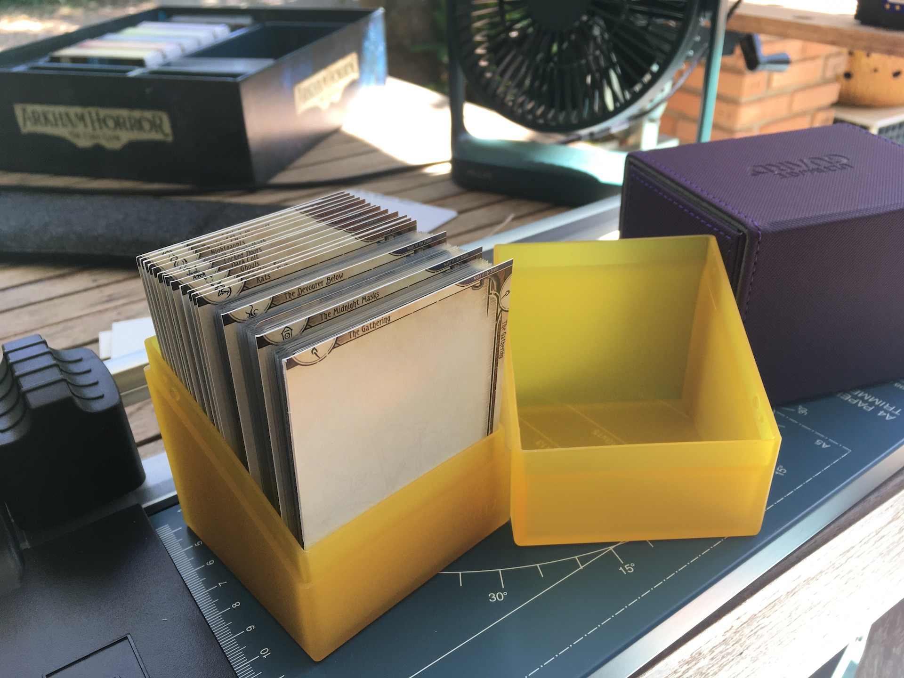
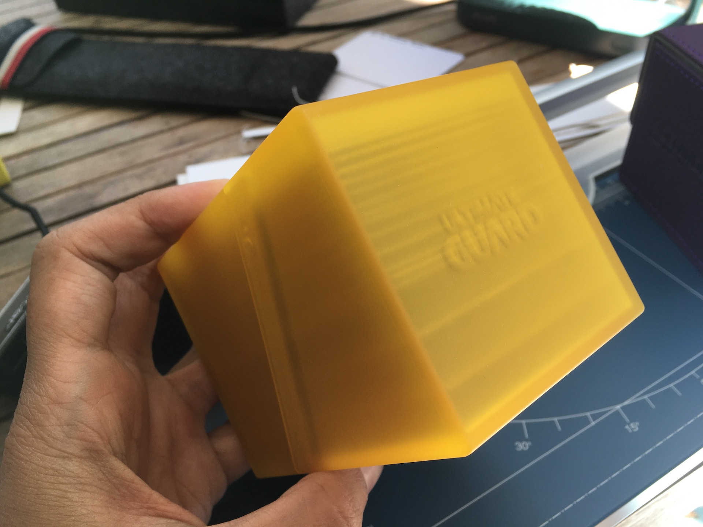
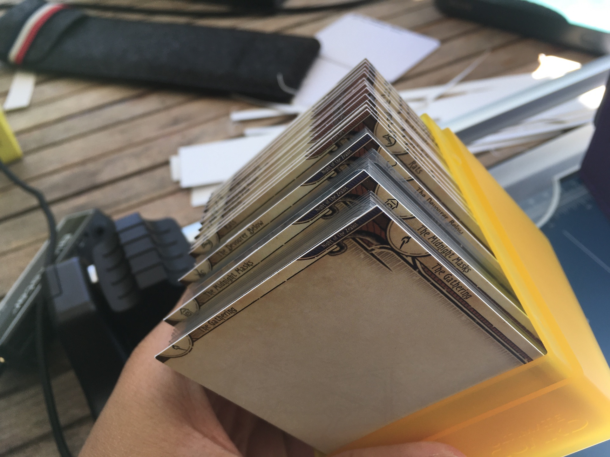
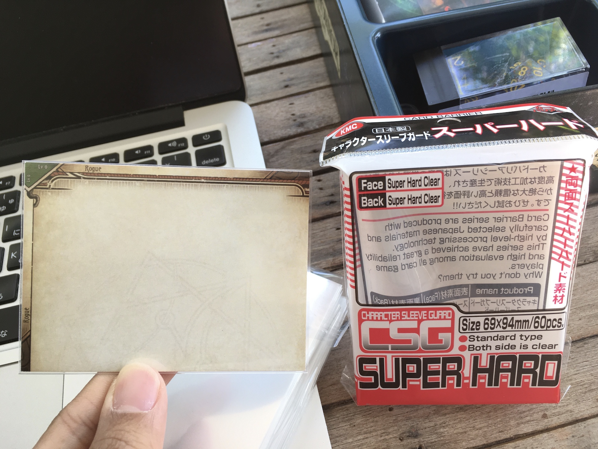
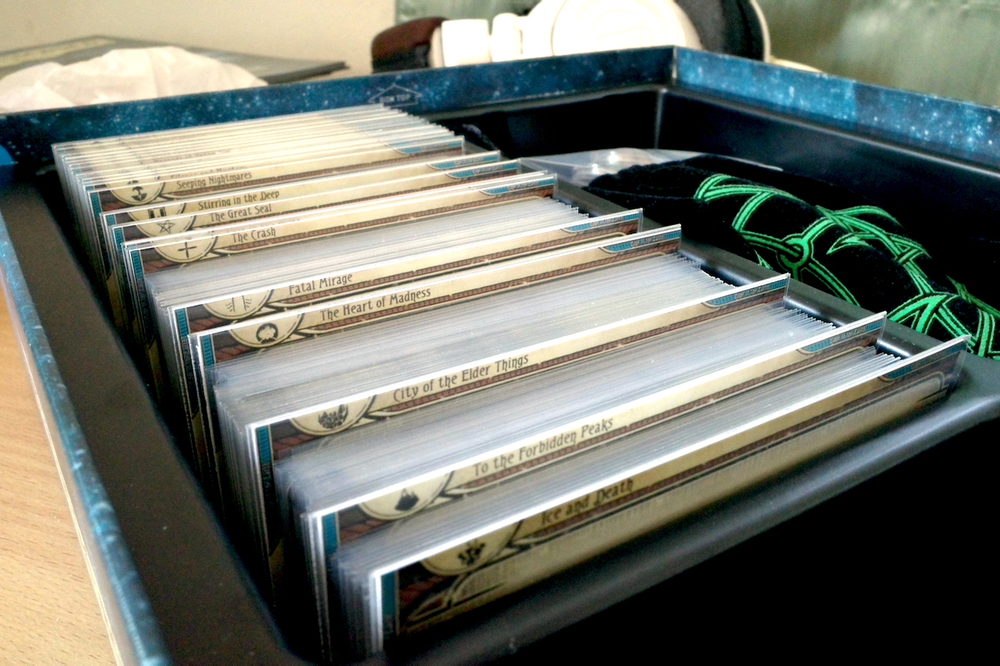
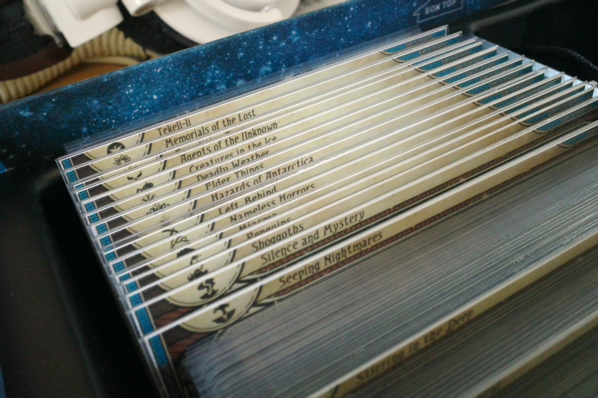
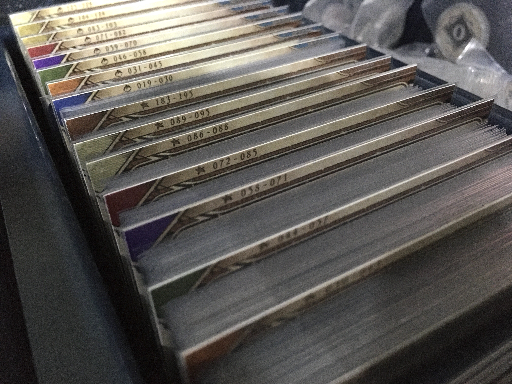
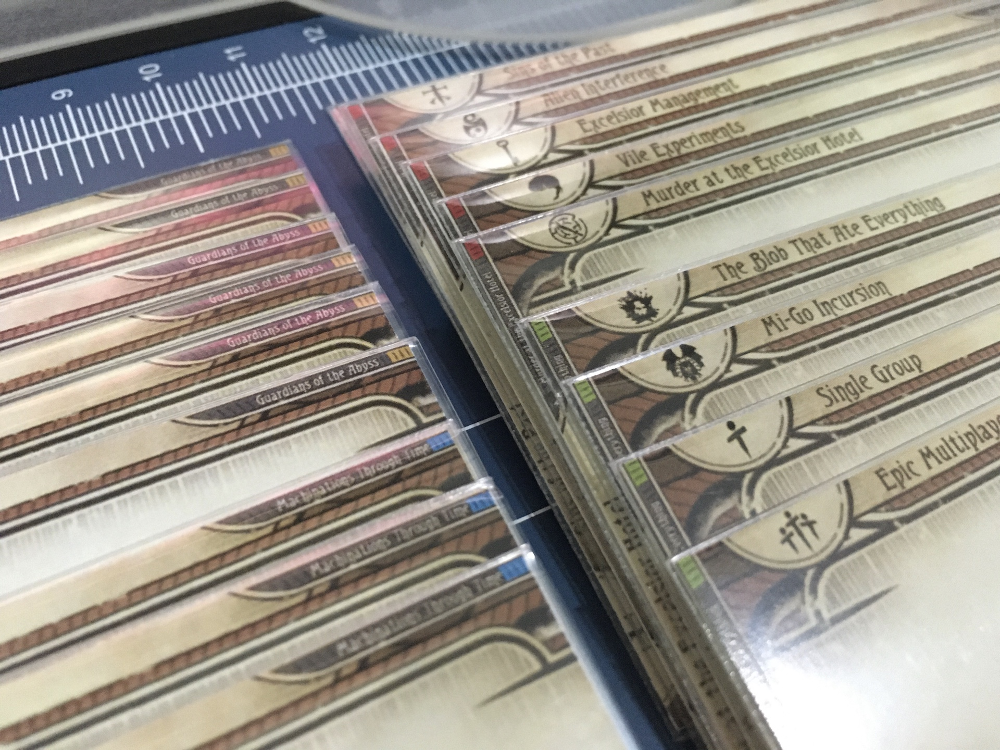

[Back to the main divider page.](/divider)

## In the Revised Core Set box

You can still close the box as usual.

Tiny but still OK to see what is what at a glance from above.

## In Ultimate Guard Boulder

Can close, but very tight. If divider is sleeved in KMC Character Sleeve, they won't fit in the Boulder anymore.

At this angle you can also see the horizontal graphics. Just ignore them!

## In Ultimate Guard Sidewinder

Unlike Boulder, this box still has wiggle room and can close nicely.

## Sleeving

It is a perfect fit inside KMC Character Sleeve Guard (69x94 mm). Depending on thickness of your paper, you may have trouble fitting this in without destroying the edge. I used 300 gsm paper and it is pretty difficult to get each one in.

Try using thin ruler or the divider to open up the 2 entry corners a bit.

## Campaigns

## Organizing by Collector Number Range (CNR)

## Organizing by Cycle Class Quantity (CCQ)

## Standalone Scenarios

