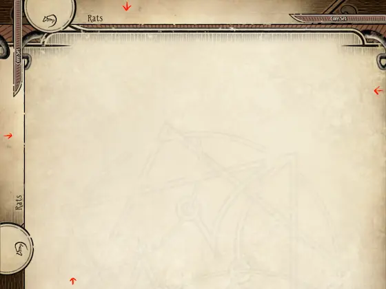
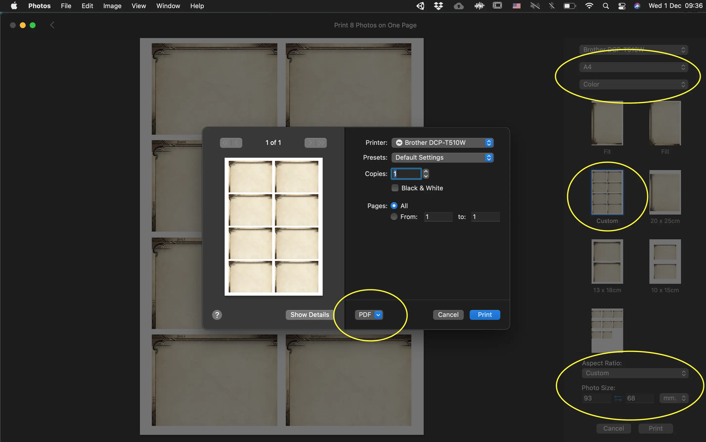
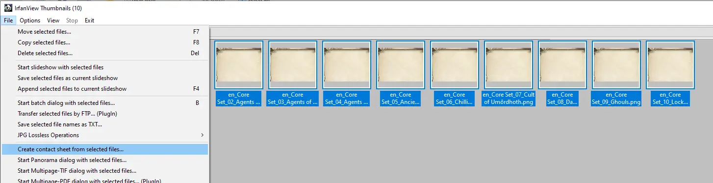
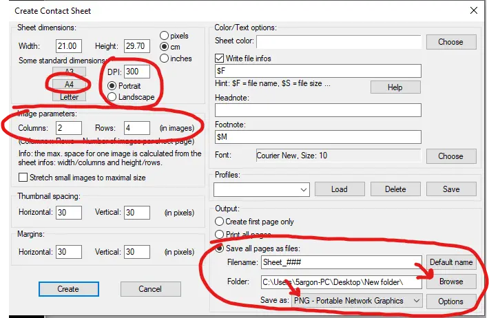
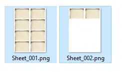

[Back to the main divider page.](/divider)

# About the bleed

After 15 October 2024, I have updated every dividers with [**bleed**](https://en.wikipedia.org/wiki/Bleed_(printing)) bringing them to printing standards. You can see very faint lines running inside the graphic indicating where the cut should be made, for your convenience if you don't have a cut guide running along the outer edge of your paper. This allow you to make a bit of mistake (outwards) while cutting and not getting whites.

You should keep in mind that the resulting physical size of **93mm x 68mm** that makes this divider a "3mm Divider" is **after** cutting the bleed out. Each graphic needs to be specify at a larger size when printing. The bleeds are +3.5mm out from each edges, therefore they add 7mm to width and height.

In summary : 

- **Downloaded size** : 1182x886 pixels, physical size 100mm x 75mm at 300 DPI.
- **After trimming the bleed out** : 1098 × 804 pixels, physical size 93mm x 68mm at 300 DPI.

# General guidelines

Send all picked graphics to any program that can laid them out on paper size then save a merged image for printing. Make sure size of each divider is **physically 100mm x 75mm** on the paper, as outlined above, so they became 93mm x 68mm after cutting the bleed out.

Some programs like to offer scaling to fit. **Make sure that is off**. If using A4 paper, it helps if you pick multiple of 8 dividers to not waste the paper.

If you send the files to print shop they should be able to understand that. If you are doing it on your own, these examples might help.

# Examples

## macOS : Using Photos app

<!--  -->

- Open "Photos" program.
- Drag 1 divider folder to it to import all images inside.
- Highlight all images you just imported.
- Press `Cmd + P` to bring up print dialog.
- Setup : A4 (or any paper size you want), Color, Aspect Ratio : Custom, Photo Size : **100 x 75 mm**. Then press Print.
- The next dialog, do not press Print, but press the dropdown saying "PDF" then select the "PDF" choice to save a file out of it instead.
- After it finished saving PDF, you can now go back and press delete to remove the highlighted images. If there are more than 8 images, the produced PDF will be multi-page.

Note : If you don't have any printer installed in the list, the page may **not fit 8 dividers** like shown because the system assume a certain default value of paper's edge to reserve. The information that the printer can print closer to the edge of paper comes differently depending on printer. You can install "imaginary printer" on macOS just so it allows removing the margin by : 

- Go to Add Printer page. Select 2nd tab "IP". (The globe icon)
- Enter random Address, and "Internet Printing Protocol - IPP" protocol, then random Name.
- Use : Generic PostScript Printer.
- Now you can press Add button. Afterwards the margins should be removed and you can now fit 8 dividers in A4 page.

## Windows : Using IrfanView app

I can't believe it is so difficult on Windows 10 to do this!! The new Photos app has only paper size adjustment but not the size of individual image. "Restoring" the old Windows Photo Viewer via Registry Editor also similarly lacks control. Paint, Paint .NET, GIMP requires manually laying out each image on the page.

The only good solution I found is this external program [IrfanView](https://www.irfanview.com/).

- Download and install [IrfanView](https://www.irfanview.com/). This program is extremely small but really capable.
- On Desktop, execute "IrfanView 64 Thumbnails" shortcut (Not the regular "IrfanView 64").

  

- Go to where your dividers are and highlight all you want to print. For example, I want to print these 10 images. (Can overflow 8, and can be any number not just multiple of 8. So you are free to mix just dividers you want from different folders.)
- File > **Create contact sheet from selected files...**

  

- Setup like this : 
  - Press A4 button.
  - Set DPI to 300 and Portrait.
  - 2 Columns, 4 Rows to get 8 dividers in one page.
  - **Do not tick** that stretch checkbox.
  - I think you can leave spacing and margin at 30 pixels.
  
    But, depending on how tight on the edge your printer can perform, you may want to increase the margin. But beware that if margin is too large, **it will start shrinking images** to honor that margin and required columns and rows per page.
	
  - On the Output section, use "Save all pages as files". Select destination and choose **PNG** as the format. PDF is there but I believe requires installing a plugin from this program's homepage, so PNG should be easier.
  - Press "Create" and check the output files. More than 8 files should overflow correctly to more sheets. Check one last time if they are all at size 3508 x 2480 or not. (If not, you may forgot to specify 300 DPI earlier.)

    

# Finishing touch

You may use rounded corner punch on them and maybe sleeve to make them last longer.

The size 93mm x 68mm after cutting the bleed out can fit inside KMC Character Sleeve just right. The trick to get it in is using the corner of divider or small ruler to stretch open up the 2 entry corners of the sleeve a bit. If you can get both corners in at the same time, the rest will be easy.