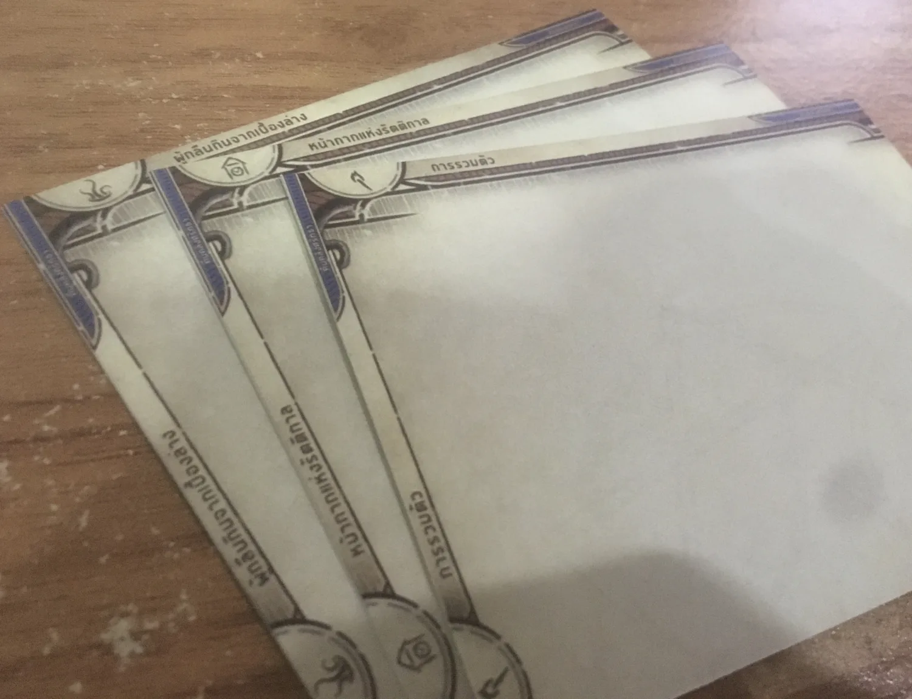
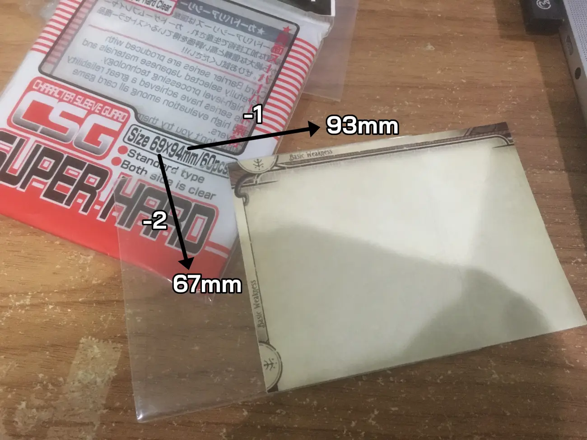

[Back to English page](./)

ในเมื่อประเทศเราได้ Localization เป็นของตัวเองซะที โปรเจค 3mm Divider จะไม่มีภาษาไทยด้วย keyword official ต่างๆได้ยังไง ผมเลยทำหน้าพิเศษหน้านี้มาเพื่อผู้เล่นชาวไทยจะได้มีที่คั่นภาษาไทยใช้กันครับ (สำหรับตัวคั่น Campaign Expansion ต่อๆไป ต้องรอมันมาก่อนนะผมถึงจะได้คำต่างๆมาทำต่อ)

นอกจากจะเป็นตัวคั่นเดียวในโลกที่มีภาษาไทย ดีไซน์นี้ใช้พื้นที่น้อยที่สุดแล้วล่ะมั้งสำหรับจัดระเบียบการ์ด[อาถรรพ์แห่งอาร์คัม เดอะการ์ดเกม](https://www.towertacticgames.com/blogs/announcement/arkham-horror-lcg) แน่นอนว่าใส่ในกล่องหลักแล้วยังปิดฝาได้เหมือนเดิม ดังนั้นใครเพิ่งเริ่มเล่น ไม่ต้องซื้อกล่องใหม่ก็ใช้ตัวคั่นพวกนี้ได้เลย ใน insert พลาสติกเดิมของกล่องนั้น ชื่อตัวคั่นมาจากพื้นที่ความสูงของตัวอักษรแค่ 3 มิลลิเมตรของตัวคั่นนี้ครับ

เวลาตัวคั่นมีพื้นที่เล็กๆแบบนี้ แถมยัง**มีทั้งแนวตั้งและแนวนอนในแผ่นเดียวกัน** ทำให้ต่อไปไปใช้กล่องแบบไหนก็คงไม่ต้องทำใหม่ นอกจากนี้กลุ่มไหนที่บางๆ อย่างความชั่วร้ายจากบรรพกาลที่มีแค่ 3 ใบ ก็จะไม่บังกลุ่มที่ตามหลังมาด้วยครับ ภาพตัวคั่นนี้เคยอยู่ในกล่องแนวนอน ย้ายไปกล่องแนวตั้งพร้อมกันกับการ์ดได้เฉย

สำหรับการ์ดผู้เล่น ก็ทำไว้เผื่อหลากหลายการจัดระเบียบมากๆ ใครชอบจัดแบบไหนก็คิดว่าน่าจะมีตัวคั่นที่ใช้ได้ครับ (ของภาษาอังกฤษ มีไปถึงชุดล่าสุดแล้ว ซึ่งอาจจะต้องคั่นแบบพิสดารขึ้น) แม้แต่ตัวคั่นเปล่าๆที่เอาไปเขียนเองก็ยังมี ถ้าไม่มีอันไหนตรงจริงๆอ่ะนะ

# ทำยังไง

1. ไปหน้า [ดาวน์โหลด](./download) เลือกภาพที่อยากได้ทีละอันๆ โหลดมาสะสมไว้ (โฟลเดอร์ th ถึงจะเจอตัวคั่นภาษาไทย)
2. ไปดูหน้า [วิธีพิมพ์](./print) ว่าทำยังไงภาพที่เลือกมาจะมาจัดอยู่บนกระดาษแล้วมีขนาดที่ตัดเสร็จแล้ว ออกมาถูกต้อง
3. พิมพ์ออกมาเสร็จแล้วก็ตัด ต้องได้ขนาด **93 x 67 mm**.
4. หาซอง Outer Sleeve ซึ่งขนาด **94 x 69 mm** มาใส่ ก็จะได้ตัวคั่นที่ความสูงกำลังดีและทนทานตลอดไป เย้

## พิเศษ! ชุดตัวคั่นผู้เล่นใหม่ พร้อมส่งพิมพ์!

ปกติในหน้าภาษาอังกฤษ วิธีทำบอกให้ไปเลือกภาพที่อยากได้มาแพคเป็นกระดาษเพื่อพิมพ์ออกมาเอง เพราะผมไม่รู้ว่าแต่ละคนจะอยากจัดการ์ดเป็นแบบไหน โดยเฉพาะการ์ดผู้เล่น

แต่ของไทยมีบริการพิเศษแพคเป็นไฟล์ PDF A4 ด้วยขนาดที่ถูกต้องเรียบร้อยพร้อมเส้นสีดำสำหรับเล็งตัด เอาไปส่งร้านพิมพ์เลเซอร์กระดาษดีๆได้เลย บอกให้เขาตัดให้ด้วยก็อาจจะได้นะเพราะเราทำเส้นตัดไปให้หมดแล้วอย่างดี ความหนาที่แนะนำคือ 250 แกรมขึ้นไปนะครับ แต่จะมี outer sleeve มาเพิ่มความหนาอีกอยู่ ถ้าใช้รุ่นที่แข็งๆก็จะช่วยได้

ข้อเสียคือบางตัวคั่นที่ไม่อยากได้ก็อาจจะติดมาด้วยในหน้าเดียวกันที่แพ็คไปให้ กับมัดมือชกนิดหน่อยเรื่องการจัดการ์ดผู้เล่น (เลือกแบบ Lv.0 + Lv. 1~5 ไปให้ ต่อคลาส) ถ้าไม่ชอบจัดแบบนี้ ก็คงต้องไปโหลดภาพแยกมาประกอบเป็นกระดาษเอง

ไฟล์ PDF นี้มีทั้งหมด 5 หน้า ขนาด A4 โดยแต่ละหน้าจุได้ 8 ตัวคั่น [**ดาวน์โหลดที่นี่ (53.3 MB)**](https://drive.google.com/file/d/161q2SKUG7Ps1CDQtcqVWU5o6WMLIwx-v/view?usp=sharing)
 

- **หน้า 1~2** : ตัวคั่นสำหรับทั้ง 3 ด่านของคืนคลั่งศรัทธา และชุดเผชิญหน้ากล่องหลักทุกชุดที่จะต้องนำไปใช้ใน Campaign อื่นๆที่จะออกมาในอนาคต มีทั้งหมด 16 ตัวคั่น ใช้ทั้งหมด 2 หน้า A4 เป๊ะๆ
- **หน้า 3~4** : สำหรับแบ่งการ์ดผู้เล่นเป็นคลาสละ 2 ส่วน คือระดับ 0 ที่ใช้สร้างเด็คตอนเริ่มใหม่ได้ กับระดับ 1 ~ 5 ที่เอาไว้เติมใส่เด็คระหว่างเล่น มีทั้งหมด 12 ตัวคั่นแล้วเหลือที่ว่างอีก 4 ตัวคั่น เลยจะแถมของแถมดังนี้
  - สำหรับเก็บนักสืบและการ์ดประจำตัวที่ไม่ได้ใช้งาน
  - สำหรับเก็บจุดอ่อนพื้นฐาน (ดูว่ามีสัญลักษณ์ตามในภาพนะครับ ว่าพื้นฐานมั้ย)
  - ตัวคั่นว่างไว้ทำอะไรก็ได้เช่นไว้คั่นการ์ดอ้างอิงกฎ
  - ตัวคั่นหน้ากากแห่งรัตติกาลซ้ำอีกรอบ แต่แถบเขียนว่ากล่องหลักแทน ตัวคั่นนี้ แนะนำให้เอาไปคั่นการ์ดเผชิญหน้าทั้ง 5 ใบในด่านนั้นแยกออกมา (เบาะแสปลอม 2 ใบ + เงาตามติด 3 ใบ) เพราะ Campaign กล่องในอนาคตจะเรียกหา 5 ใบนั้นค่อนข้างบ่อย จะได้หาเจอไวๆ
- **หน้า 5** : 8 ตัวคั่น ไว้คั่นเด็คผู้เล่นระหว่างเซฟเกมไว้เล่นวันหลังได้เต็ม 4 ผู้เล่น และมีตัวคั่นไซด์เด็ค (Side Deck) สำหรับแต่ละคนด้วย ไซด์เด็คเกมนี้นิยมเอาไว้พักการ์ด Lv. 1 ~ 5 ที่วางแผนไว้ว่าอยากเติมเข้าเด็คหลังจากได้ประสบการณ์มา เพื่อให้ระหว่างด่านเลือกช๊อปจากแค่ในไซด์เด็คได้ ไม่ต้องไปคุ้ยคลังการ์ดทั้งหมด

# รายละเอียด

**ขนาดต่างๆค่อนข้างสำคัญ** ดังนั้นรบกวนอ่านหน่อยครับ โหลดภาพไปแต่ละภาพนี้ขนาดโลกจริงคือ **100 x 74 mm** แต่ขนาดนี้รวมพื้นที่ตัดตก (bleed) แล้ว จะเห็นว่ามีเส้นจางๆสำหรับเล็งตัด

ตัดอย่างถูกต้องแล้วถึงจะเหลือ **93 x 67 mm** ที่เอาไปใส่ใน "Outer Sleeves" ซึ่งขนาด **94 x 69 mm** ได้พอดี

จะสังเกตุว่าด้านสั้นต่างกันกับซองใส 2mm แต่ด้านยาวต่างกัน 1mm เท่านั้น เหตุผลเพราะว่าเวลาเราดันใส่ซองด้านสั้นจะตัดสินว่าใส่เข้าหรือไม่ ถ้ามันแน่นเกินไป ถ้าตัดเบี้ยวออกนิดเดียวจะกลายเป็นดันไม่เข้าเลย ก็เลยเผื่อไว้ให้ 2mm ครับ ถ้าตัดขนาดเป๊ะทุกอย่างดันเข้าไปสุดแล้ว จะมีขอบใสด้านสั้น 0.5mm และด้านยาว 1mm เป็นไปตามที่เผื่อไว้หารสองใส่ด้านตรงข้ามกัน

ผลคือได้ตัวคั่นที่ยกตัวเองขึ้นมาสูงพอที่จะเห็นตัวอักษรได้ ไม่ว่าการ์ดจะใส่ซองแบบ standard หรือแบบ perfect-fit โดยถ้าใส่ซอง standard จะเห็นอักษรโผล่ขึ้นมาแค่ 3 มิลลิเมตรตามที่โฆษณาไว้เลยครับ ถ้าซอง perfect-fit ยิ่งเห็นมากขึ้น

แปลว่า การใส่ซอง outer sleeve นี่ค่อนข้างเป็นภาคบังคับถ้าการ์ดในคอลเล็คชั่นใส่ซองไว้ เพราะนอกจากจะทำให้คงทนแล้ว มันเพิ่มความสูงของตัวคั่นให้ด้วย 1 มิลลิเมตร ทำให้ยกตัวอักษรขึ้นมานิดหน่อยให้สู้การ์ดที่ใส่ซองแล้วได้

## ซื้อ Outer Sleeve ยี่ห้อไหนดี

ผมใช้ KMC CSG Character Sleeve Guard รุ่น "Super Hard" แต่ก็เหมือนเห็นว่า Gamegenic กับ Dragon Shield ก็ทำ Outer Sleeve ขนาดเดียวกันนี้แหละ ไปลองหาซื้อเจ้าที่ชอบได้ครับ
