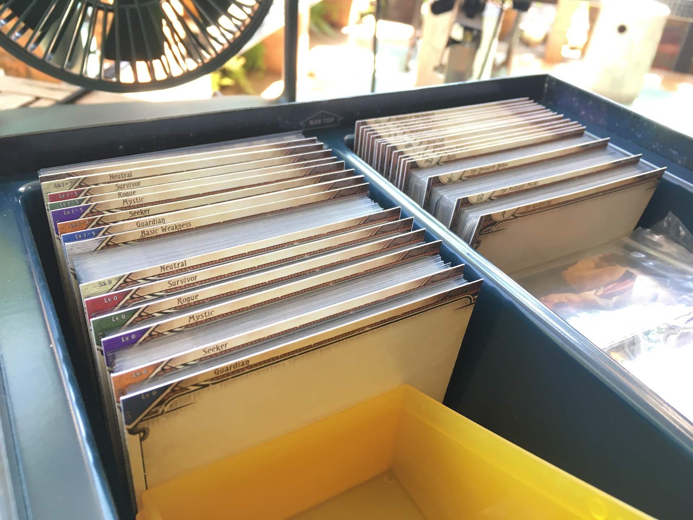
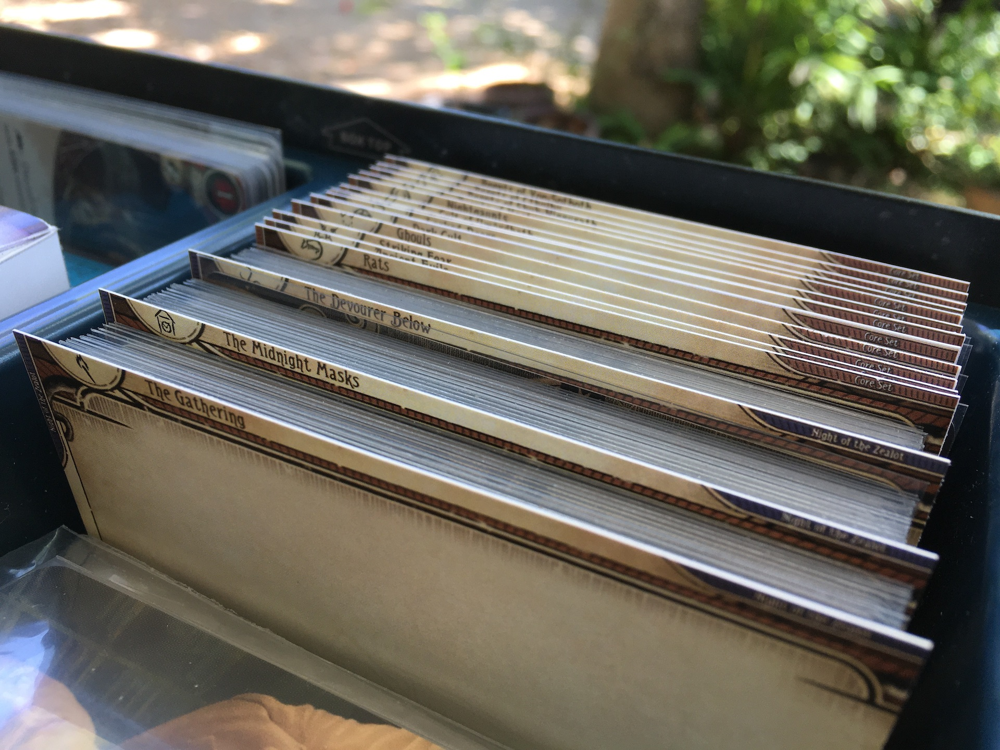
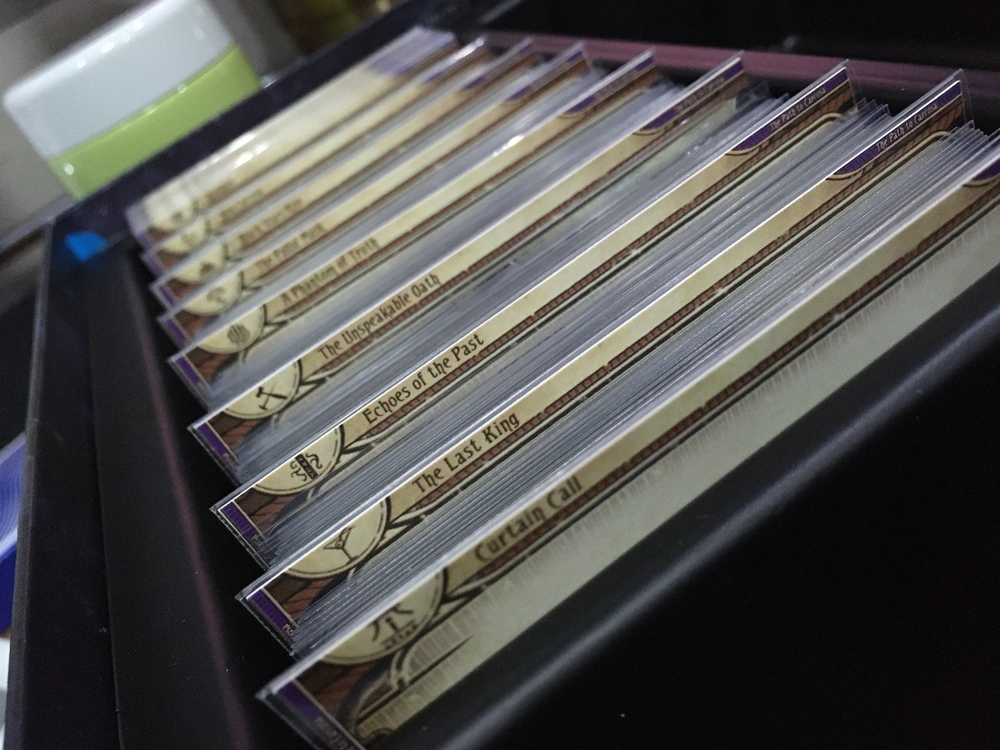
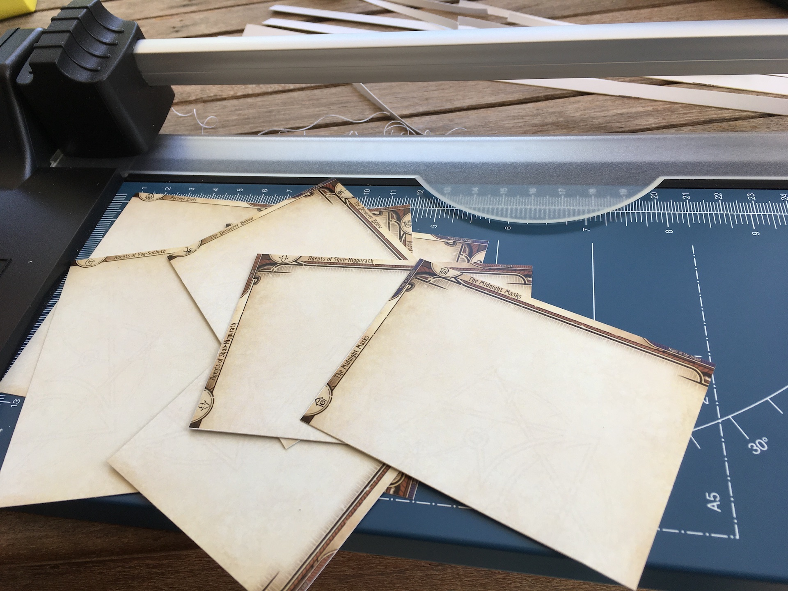

Minimal, flexible, and multilingual divider graphics for [Arkham Horror : The Card Game (LCG)](https://www.fantasyflightgames.com/en/products/arkham-horror-the-card-game/) card organization.

# How to make them

1. Go to [Download page](./divider/download) and hand pick all the desired divider files you want. Table of contents of all dividers are also in that download page.
2. Go to [Printing page](./divider/print) on how to make all those files come out the right size for use.

# Gallery

See photos of variety of organizations in action in the [Divider Gallery Page](./divider/gallery).

# Introduction

Unlike other existing dividers, they have unusual traits gained from the divider size of 93mm x 68mm. To help visualize this size, the size of standard size card is 89mm x 64mm, which gets +1 mm to 90mm x 65mm when fitted with perfect sleeves. (+0.5mm for each side.)

So that left **only 3 mm difference for text space**, and became the name of this project. Why should we go small though?

## Wide range of compatible storages

When the divider is only a bit taller than the cards, it is mostly compatible with any box you used for your cards without folding it. Using these dividers in the Revised Core Set and repackaged campaign box won't add too much height. The box still closes just fine even with that left over token punch-out cardboard in the box.

I have tested with 3rd party box like Ultimate Guard Boulder, Sidewinder, Gamegenic Fourtress. Those boxes can still close.

## Not necessarily difficult to use

While tiny texts is certainly hard to **read** in normal sense, they are better than taller dividers that you can see more dividers behind it when each section has low amount of cards. Combined with the design that its text is hanging right **at the edge**, this turns into an advantage.

Look at the preview image above, you can barely see "Ancient Evils" divider behind "Rats" which has only 3 cards. For other taller dividers with texts printed lower into the card, you may not be able to see what that divider is.

Plus, for many dividers there is an icon too, so when you got used to the icons small text doesn't matter anymore.

## Can be sleeved

The 93mm x 68mm number is chosen for one more reason : it is an exact size of commercially available "outer sleeve". They are designed to cover "character sleeves" (card sleeve covering regular sleeve often printed with colorful art of characters of that game) in one more layer. Recommended brand is KMC Character Sleeve Guard with the dimension 94mm x 69mm, which will make this 93mm x 68mm divider a perfect fit inside it.

Other dividers with arbitrary size you need to send them to lamination machine to reinforce the dividers, which can be costly and adds too much excess transparent border, making them even more incompatible with some boxes you want to store your cards. (Like the new repackaged campaign boxes.)

## Dual orientations

A very unique feature of this divider, thanks to small text area I could afford to put the other orientation's text into the same divider, without being annoying to the current orientation.

This gives you flexibility in your storage solution which may change in the future as your collection grows. So you only print them once and perhaps buy the character sleeves once.

I myself had switched from horizontal to vertical box at some point for my growing collection. I just pick the chunk of cards along with the sleeved dividers, flip them into the new box, and done.

## Programmatically generated

You may notice that unlike other sopisticated dividers with hand crafted graphics, this design is kind of plain. It has only text, icon, and some solid colors. It is very "robotic", intentionally.

This is because the graphics are generated from applied usage of Unity game engine, which makes them consistent in layout, easy to add more in the future, or batch-modifying mistakes on all previous ones less tedious. It also works really well with generating many localizations. If not for this, maintaining all the languages would be infeasible for me.

Why this is an advantage for **you**? When you choose to go with any divider, you probably don't want the author to abandon the project some time in the future as you want your collection to be consistent and remaking them just to switch brand could be a pain. This project has low maintenance cost on my side, it equals better chance that the project can keep going for long time.

# Attributions

All encounter icons were obtained from combined effort in [this thread](https://boardgamegeek.com/thread/1671881/article/38760017#38760017). Card graphics was remixed from official FFG print-and-play PDF. I didn't design anything other than putting texts, icons, and recolor a bit.

## Languages

- English
- German (Contributed by : [@empty0911](https://boardgamegeek.com/user/empty0911), [@Miriamelbgg](https://boardgamegeek.com/user/Miriamelbgg), [@kabelrambo](https://boardgamegeek.com/user/kabelrambo))
- Italian (Contributed by : [@fabioflx](https://boardgamegeek.com/user/fabioflx))
- Russian (Contributed by : [@khrabr](https://boardgamegeek.com/user/khrabr))
- Spanish (Contributed by : [@colococolo](https://boardgamegeek.com/user/colococolo), [@Fran77](https://boardgamegeek.com/user/Fran77))
- French (Contributed by : [@retsnimel](https://boardgamegeek.com/user/retsnimel))
- Portuguese (Contributed by : [@vinimsouza](https://boardgamegeek.com/user/vinimsouza), [@benq10r](https://boardgamegeek.com/user/benq10r))
- Polish (Contributed by : ? (please let me know))
- Czech (Contributed by : [@yorrkee](https://boardgamegeek.com/user/yorrkee))

If translation is missing, file is still rendered but text area will be empty.

## Contributing translations

[Click here to access a Google Sheet spreadsheet](https://docs.google.com/spreadsheets/d/1jA8786alNXLDSA-LVSh4HzJ6gza1JqO1_XyImz7ncaE/edit) which Unity can load and generate the dividers.

Other than several left columns and `en`, you can freely edit the rest. You can contribute by filling in the other language if you would like dividers in that language generated.

Note that there is no fallback to `en`, it will be blank if there is no text in that cell.

After you have added some translations, you can ping me somewhere, like in [BGG forum thread](https://boardgamegeek.com/thread/2766339), and I will regenerate the graphics and update them into [the download page](./divider/download).

# How to make them (just in case you missed it)

1. Go to [Download page](./divider/download) and hand pick all the desired divider files you want. Table of contents of all dividers are also in that download page.
2. Go to [Printing page](./divider/print) on how to make all those files come out the right size for use.

# Links

- [BoardGameGeek Forum Thread](https://boardgamegeek.com/thread/2766339) : This is probably where I would be informed the quickest if you found any problem or have some requests of dividers.
- [GitHub Repository](https://github.com/5argon/AHLCG3mmDivider) : Hosts the Unity game engine project which automatically generates all these dividers in all languages. It has no documentation, but if you are experienced in Unity you maybe able to mess around with it.
