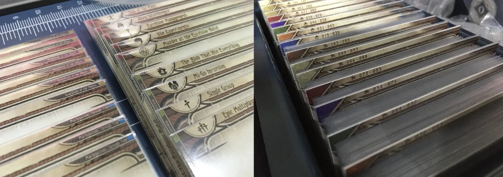
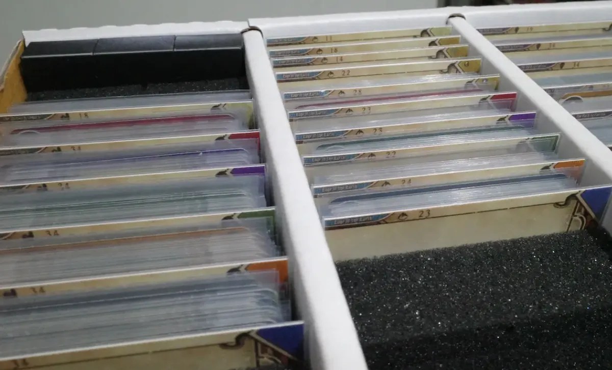
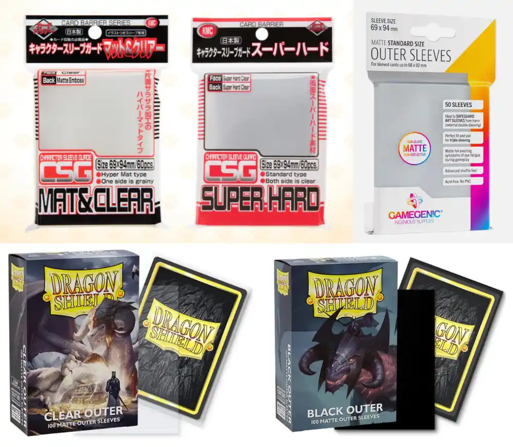

[คนไทยเชิญหน้านี้ได้ครับ / Thai Language](./divider/th)

The 3mm Divider is probably a design with **the smallest required headroom in the world** for [Arkham Horror : The Card Game (LCG)](https://www.fantasyflightgames.com/en/products/arkham-horror-the-card-game/) card organization. It features a utilitarian design varying just text, icons, and colors in that available tiny content space.

That alone makes it supports much more kind of boxes than typical dividers, and you can really read dividers that are very close to each other, such as whatever behind the 3 cards thin Ancient Evils encounter set.

You do not have to decide on the orientation as they have **both vertical and horizontal orientations in one**, future-proofing the dividers when your collection eventually grows into any kind of container, or where you temporarily bring your cards to play. These dividers were used horizontally in a Campaign Expansion box, seamlessly moved into a vertical 4 columns box.

For player card dividers, there are so many variations to fit whatever organization methods you choose. Graphics are provided individually rather than already packed in a specific paper size, so you can mix and match and print exactly those you need for how your collection works.

# How to make them

1. Go to [Download page](./divider/download) and hand pick all the desired divider files you want.
2. Go to [Printing page](./divider/print) on how to make all those files packed into a sheet you can then cut.
3. Cut the sheet to remove the bleeds and get **93 x 67 mm** size. I have some [cutting tips](./divider/cut) for you too.
4. Sleeve them in **94 x 69 mm** outer sleeves and enjoy.

# How it works

**Size is critical** on this divider. Each divider's graphic sized at **100 x 74 mm** includes bleed area and built-in cut line. After cutting it along the line you will remove **7 mm** out of width and height (that is, 3.5mm from each side) to get a **93 x 67 mm** size. It is a size to fit inside the commercially available "Outer Sleeves" size of **94 x 69 mm**. (Also called a "character sleeve", as often used to protect colorful sleeve with character's artwork.)

Notice that long side is 1 mm less (93 vs 94), but short side is 2 mm less (67 vs 69), because you insert on the short side and more clearance is needed on that side to not bend the divider while inserting. If you didn't make any mistake cutting it, after inserting all the way, you should get padding of 0.5 mm on short edges, and 1 mm on long edges.

The result works with both cards using standard size and perfect fit size. If you use standard sized sleeve, you get exactly **3mm** visible area as advertised. On perfect-fit sleeves, you can see a bit more of the divider.

If you keep cards in your collection sleeved, you should sleeve these dividers as the height added serves functional purpose rather than just durability. You lose 1mm or 0.5mm of the divider's height if you don't sleeve, depending on orientation.

## What outer sleeves are available?

I use KMC CSG Character Sleeve Guard in "Super Hard" variety. Gamegenic and Dragon Shield also made outer sleeves.

# Multilingual, programmatically generated

The design is kind of basic because they are generated from applied usage of Unity game engine, which makes them consistent in layout, easy to add more in the future, or batch-modifying mistakes on all previous ones less tedious. It also works really well with generating many localizations. If not for this, maintaining all the languages would be infeasible for me.

Why this is an advantage for **you**? When you choose to go with any divider, you probably don't want the author to abandon the project some time in the future as you want your collection to be consistent and remaking them just to switch brand could be a pain. This project has low maintenance cost on my side, it equals better chance that the project can keep going for long time.

## Languages

- English
- German (Contributed by : [@empty0911](https://boardgamegeek.com/user/empty0911), [@Miriamelbgg](https://boardgamegeek.com/user/Miriamelbgg), [@kabelrambo](https://boardgamegeek.com/user/kabelrambo), pandemoneus#1283)
- Italian (Contributed by : [@fabioflx](https://boardgamegeek.com/user/fabioflx))
- Russian (Contributed by : [@khrabr](https://boardgamegeek.com/user/khrabr))
- Spanish (Contributed by : [@colococolo](https://boardgamegeek.com/user/colococolo), [@Fran77](https://boardgamegeek.com/user/Fran77), [@Lisabo86](https://boardgamegeek.com/user/Lisabo86))
- French (Contributed by : [@retsnimel](https://boardgamegeek.com/user/retsnimel), Alex)
- Portuguese (Contributed by : [@vinimsouza](https://boardgamegeek.com/user/vinimsouza), [@benq10r](https://boardgamegeek.com/user/benq10r))
- Polish (Contributed by : ? (please let me know))
- Czech (Contributed by : [@yorrkee](https://boardgamegeek.com/user/yorrkee))
- Thai (Contributed by **ME**. Finally, it is our turn to get a localization in 2024...)
- Hungarian (Contributed by [@Veghist](https://boardgamegeek.com/user/Veghist))

If translation is missing, file is still rendered but text area will be empty.

## Contributing translations

[Click here to access a Google Sheet spreadsheet](https://docs.google.com/spreadsheets/d/1jA8786alNXLDSA-LVSh4HzJ6gza1JqO1_XyImz7ncaE/edit) which Unity can load and generate the dividers.

Other than several left columns and `en`, you can freely edit the rest. You can contribute by filling in the other language if you would like dividers in that language generated.

Note that there is no fallback to `en`, it will be blank if there is no text in that cell.

After you have added some translations, you can ping me somewhere using one of the ways in Links section below. I will regenerate the graphics and update them into [the download page](./divider/download).

# How to make them (just in case you missed it above)

1. Go to [Download page](./divider/download) and hand pick all the desired divider files you want.
2. Go to [Printing page](./divider/print) on how to make all those files packed into a sheet you can then cut.
3. Cut the sheet to remove the bleeds and get **93 x 67 mm** size. I have some [cutting tips](./divider/cut) for you too.
4. Sleeve them in **94 x 69 mm** outer sleeves and enjoy.

# Links

- [Mythos Busters Discord arkham-starter.com Dev Post](https://discord.com/channels/225349059689447425/1203293837389209650) : I'm the most active here. Mythos Busters provided a per-project space as long as they are related to AHLCG. If you have problems or request of dividers, you can go tell me there.
- [BoardGameGeek Forum Thread](https://boardgamegeek.com/thread/2766339) : I go check this from time to time too, but not as active as the Discord post.
- [GitHub Repository](https://github.com/5argon/AHLCG3mmDivider) : Hosts the Unity game engine project which automatically generates all these dividers in all languages. It has no documentation, but if you are experienced in Unity you maybe able to mess around with it.
