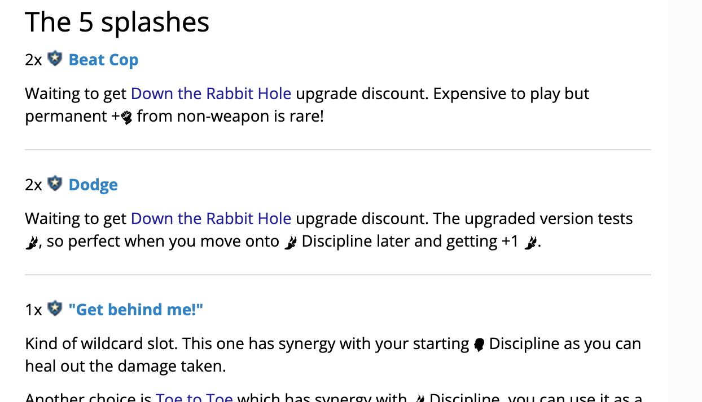
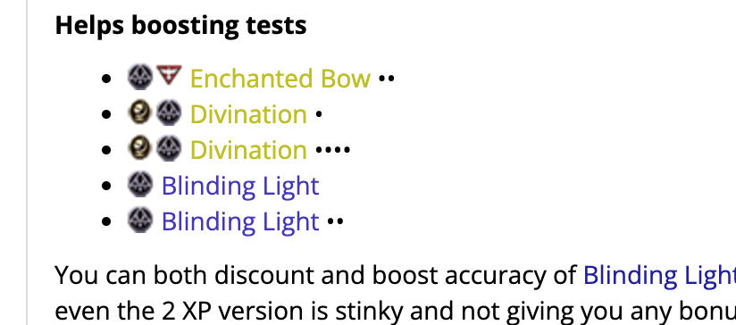
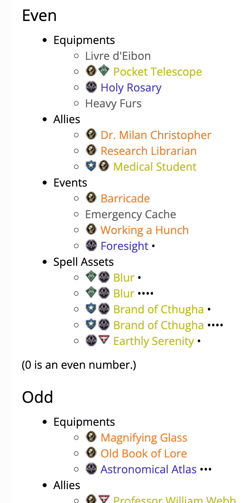
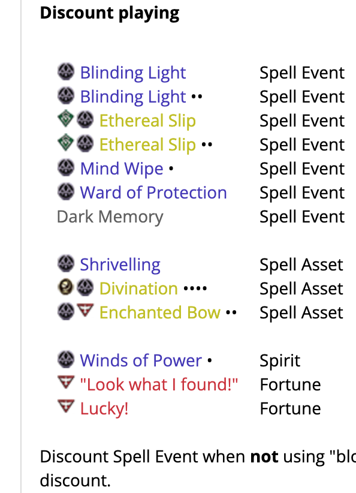
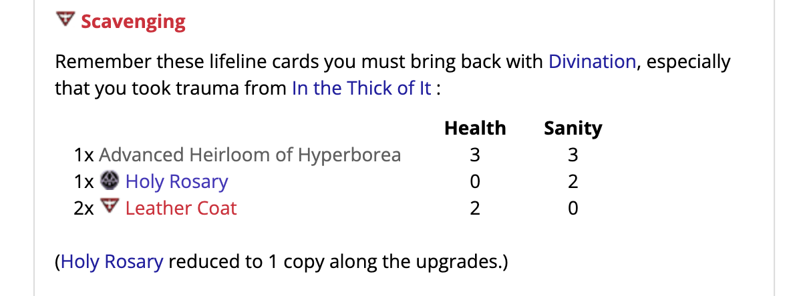

# Card List

**Note:** This tool is **not** intended to be mobile-friendly.

This tool is almost like the [Upgrade Planner](/tool/upgrade), but it is a single column instead of two, therefore it has all functions related to differentiating the XP removed. 

The biggest difference is on the export modal. The point of this tool is that you want to print something "for each" card while writing a guide. For example, pointing out some cards in the deck that synergize well with something.

This tool make the card name part correctly colored, linked, and have XP pips. It will also exports a text such as `TYPEHERE`, because usually you want to say something about each card and it can be difficult to find where to type in the sea of HTML tags.

## Importing a deck

You can paste ArkhamDB's deck URL into the box. Other than grabbing the deck ID number from the URL, it also detects a kind of deck from the URL :

- If it has `/decklist/view` or `/decklist/edit` : It requests a deck from published deck API of ArkhamDB.
- If it has `/deck/view` or `/deck/edit` : It requests a deck from personal deck API of ArkhamDB, which **would fail if** that user hadn't check the "make public" option in your user settings. Also if you are currently editing the deck and have changes in the card list, save it first before importing.

You can also type just the deck's ID number, but it always assume it is a personal-but-public deck. To type just deck's ID and you want it to meant published deck, prefix `p:` in front of ID.

## Options

Regardless of styles, you can control some other options that would applies to all styles, such as making the card's name bold.

## Styles

### List

This simply give you a card's name, then double new lines later, it is where you can type about that card. Note that in Markdown, 2 newlines are required to count as being a new paragraph, otherwise it would be at the same line as the card's name. (Sometimes you may want to do just that, however.)

`TYPEHERE` is placed at the right place to help with this.

### List with horizontal lines

Like "List", but `---` has been placed in-between each cards. (That would be converted to a nice line by the Markdown engine.) There is no line on the top of the first card and next to the last card. I think the list looked better that way.

### Bullet points

Append `- ` in front of each card to make them bullet points.

When XP pips are used in this style, they are not enlarged to emulate the pips on your decklist unlike the "List" style. The reason is because it mess with line height of the bullet point. (Cards with XP would take up a bit more line height than lv.0 cards.)

There is a secret feature on this style, which if your list contains even one divider row, the divider will take the 1st level of the bullet point and everything else will move to the 2nd level.

### Table (with left-aligned empty column)

Export a Markdown table with 1 column for the card, and 1 column with a placeholder text so you can see easier where to type. Divider rows are possible to use to make some empty rows like the image above, while still keeping the table lined up as a whole.

What makes Markdown table tricky is not just how you type it, but also that ArkhamDB can render it fine, however not having any stylesheet applied on it. The result is that each column has 0 padding and would appear right next to each other, etc.

Therefore Markdown exported from this style will have several "hacks" baked inside. For example : 

- There is one empty column appended in front just to shift the table a bit from the left edge.
- Behind each card's name, it append a "　" character to pad out the right side of the column, so the next column is not sticking right next to the card's name.
- There is one extra useless row at the end to add some bottom padding, otherwise it would stick to your next texts.

You can continue editing the table and add some more columns, following the exported template.

You can change the alignment by changing the weird row between table header and the data rows. Left, center, and right align would be `|:--|`, `|:-:|`, and `|--:|` respectively.

### Table (with center-aligned empty column)

It is a bit different that the column it made for you has center align. This center aligned column is great for adding single digit numbers, and you can copy paste a bit to add more.

That is not all, the column's header also has a hack that it is surrounded by "　" character to pad out both sides of the column. This only works for center aligned column.