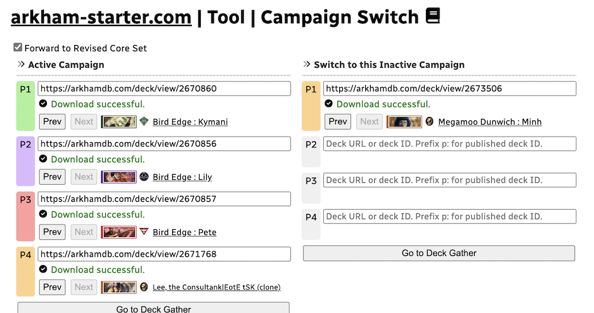
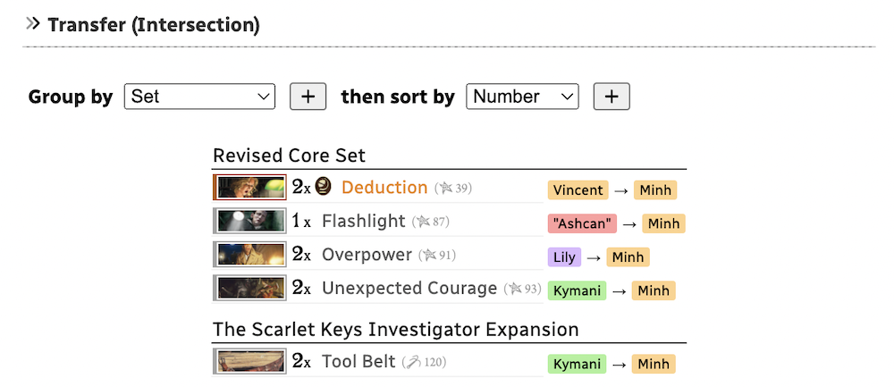
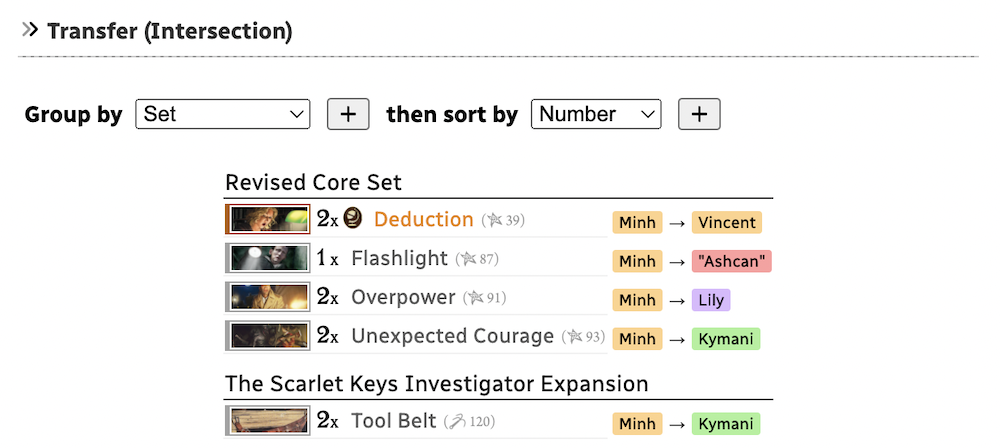

# Campaign Switching Tool

This tool let you specify 2 ongoing campaigns, one campaign consists of up to 4 arkhamdb.com decks. (Therefore you can enter up to 8 decks.)

- Active Campaign : Cards from your collection are pulled out to make the decks of Active Campaign as much as possible.
- Inactive Campaign : Take all the leftover cards in the collection after building all the Active Campaign decks. These decks are likely incomplete and waiting for some hot cards inside decks of your Active Campaign to continue playing.

Then it assume all other cards are stored in your collection. (So imagine you have 3 different groups of cards here.)

This tool reveals you how to **switch from Active Campaign to Inactive Campaign** without dissolving all the decks back to collection first, by telling you to pick cards from which of the left deck (and also whether it is from main or side deck) to land on which of the right deck. In other words, it shows an **intersection** of 2 campaigns (up to 4 decks vs. 4 decks).

It is also useful to know if the switch is too much and you would rather dissolve all the decks back to collection.

This tool is inspired by arkhamdb.com's compare decks tool ([such as this](https://arkhamdb.com/deck/compare/2533514/2091839)). But that tool only compares 2 decks instead of 2 teams of 4 decks each, plus it ignores the Side Deck.

## Example

I use my player cards and campaigns to run a 4 players Edge of the Earth campaign with my close friends. However there is also AHLCG community in a local game shop, each player their has their own player cards and I only need to bring my deck and The Dunwich Legacy campaign there to play.

Both campaigns alternates in irregular pattern due to life schedule of each players, so it is unwise to disassemble any deck because of the uncertainty. As a result, I need 5 decks built at the same time.

4 decks of Edge of the Earth party would use 4 out of 5 classes to easier resolve overlaps, since we assembled the party together. But I have less control over the other Dunwich Legacy party because they are not aware of my running Edge of the Earth campaign which class aren't used. My 1 deck in The Dunwich Legacy campaign ended up using the same class as the other 4 decks, and caused some overlaps.

This tool allowed me to assemble a box of 5 decks. Inside this box there are 2 "states", it is either 4 complete decks and 1 incomplete deck, or 1 complete deck and 4 incomplete decks, depending on the active campaign. I no longer need to go back to my collection knowing that everything is in this box.

Assuming that Minh Thi Phan deck is that 1 deck in The Dunwich Legacy campaign, this is the output when switching from Edge of the Earth to The Dunwich Legacy, taking bits and pieces of all 4 decks.

And this is when I want to switch back to play Edge of the Earth with my close friends, using the Swap button.

## Algorithm details

### Transferring cards is preferred over pulling from collection

For example, if **both** Active and Inactive Campaign are using 4x Knife, the tool will **transfer 4x Knife**, even though Revised Core Set gives you 10x Knife and there are more waiting in the collection.

The tool assume you would rather transfer cards than going back to pick leftovers in the collection. I often pack all 5 decks of 2 campaigns in a ~300 count box. (Recommended the [Gamegenic Fourtress 320](https://www.gamegenic.com/product/fourtress-320/)) And it is reassuring that I have everything to play both campaigns inside that box and could left my big collection at home.

### Player order

The player order does matter. It iterates from the first player to the last. Therefore, there is more chance that a lot of first player's deck got transferred to Inactive Campaign than subsequent decks. e.g. If someone in Inactive Campaign needs 2x Unexpected Courage, and the 1st deck and 2nd deck of Active Campaign both uses 2x Unexpected Courage, the tool would tell you to transfer 2x Unexpected Courage of the 1st deck and not touching those of the 2nd deck.

### Using the Side Deck

When upgrading decks of either on-going campaigns, try moving the card that is **removed** from the deck to Side Deck. This way the card "technically exist" for the tool to detect and report the transfer.

For example, in your active campaign you have Zoey with Vicious Blow and is planning to upgrade to Vicious Blow (2). In the other campaign you have Ashcan Pete that is splashing Vicious Blow. Initially the tool would report the Vicious Blow transfer between Zoey and Pete.

However after Zoey upgraded to Vicious Blow (2), if you also put her previous Vicious Blow into the Side Deck, the tool will say "transfer Vicious Blow from Zoey's Side Deck to Pete's Main Deck". If you just make Zoey's Vicious Blow disappear from her deck, tool will no longer report Vicious Blow and assume they were always in Pete's deck.

There are "previous" and "next" button to nudge the deck's history as they go through a campaign. Sharing URL will also change as a result.