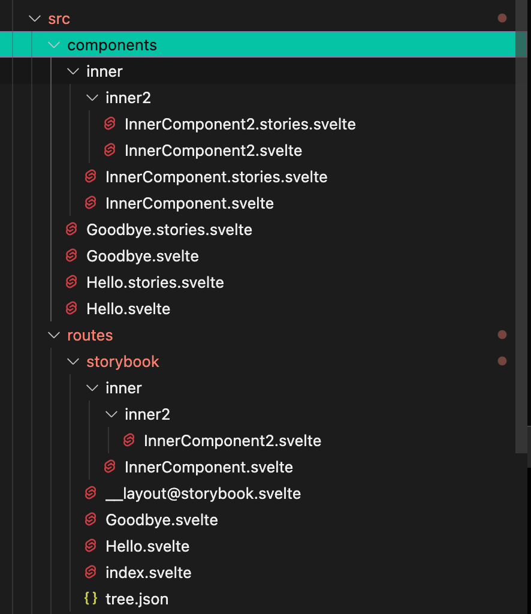

# sveltekit-stories-watcher

By inputting 2 directories as input and output to this Deno script : It watches for any changes in the input directory. When detected, it completely clears out the output directory.

It then search for all `.stories.svelte` files in the input directory, then for each story file found, create an equivalent directory structure in the output directory that the leaf is a Svelte file that imports relatively, travelling to it with `../../` so it works regardless of your `$lib` setup of your project. The content of this file simply renders the story file in the input folder.

The intention of this tool with SvelteKit is to choose the output folder as somewhere inside the `routes` folder. (Such as `routes/storybook`.) And input folder where you develop your components. Essentially, we are generating a DIY [Storybook](https://storybook.js.org) viewer right inside your site that is usable by going to a specific URL while running `svelte-kit dev`, since they are in `routes`.

This allows you to develop components in isolation, utilizing the same blazing fast reload of Vite, inheriting everything your site can use such as styling, and without many opaque configurations that would comes with a real Storybook install.

**But** you will have to further develop the UI of your Storybook, such as navigation side bar and stylesheet. This script only involves putting things inside your `routes` to piggyback on Vite as a Storybook runner.

## Example



This is how the output folder `src/routes/storybook` is regenerated, given the content of input folder `src/components`.

## How to run

Run `deno` on the `mod.ts` file like this.

```
deno run --allow-read --allow-write mod.ts ./src/components ./src/routes/storybook
```

The program will not terminate and keep watching for changes.

### Special files generated

- `__layout@storybook.svelte` : The content of this layout is empty. But it forces all generated components to use `__layout-storybook.svelte` outside of the regenerating folder, which becomes the "customization point" you can freely design. You must have `__layout-storybook.svelte` in your `routes` or else it would complain about not finding it.
- `tree.json` : Contains a constant that describe an entire tree of folders leading to each of your stories. You can import this automatically generated constant to create your own navigator, etc. 

  TypeScript interface of this `.json` file looks like this, it is a recursive type.

  ```ts
  type TreeConstructor = { [k: string]: TreeConstructor | null };
  ```

  If the value side is `null`, this is the leaf node. Otherwise the tree continues. In Svelte, you can use `Object.entries` on this object then it is compatible with `{#each}` block, like so :
  
  ```svelte
  {#each Object.entries(tree) as [k,v]}
	<!-- Check if v is null or not. -->
  {/each}
  ```

- `index.svelte` : Allows going to the bare address and not getting error. If you made a sidebar in the layout, you can now use that to go to the story.

## Limitations

The orignal Storybook allows you to write story one after another in the same file, yet in the final result allows you to view them one by one using the sidebar navigator. This is mainly because in JS we can have multiple exports and each one has its identity. In Svelte, each file is strictly one thing unless we do named `slot` gymnastics, which we won't. Also, this tool intentionally **not** check the content of any `.stories.svelte` file for simplicity and speed.

Therefore if you wrote multiple stories in the file, they would really be lining up vertically when you visit the page. This is mostly not a big problem, just scroll down to the story you want to focus on. Hot reloading will keep the scrolling anyway.

It is possible to add blings on your own on top of this tooling. (Such as wrapping in `<Stories>` or `<Story name="...">`, etc.) But it is not the point of this tool.