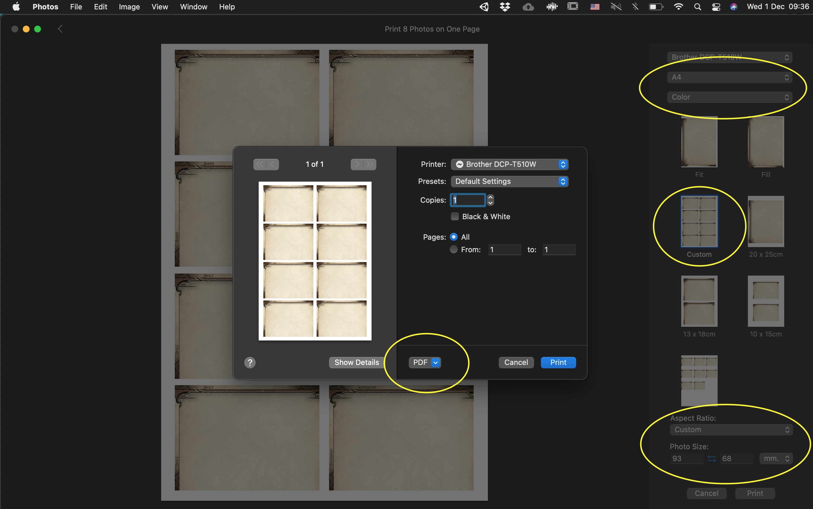
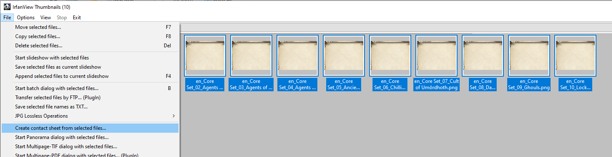
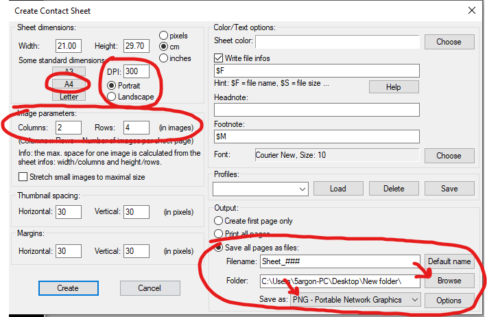
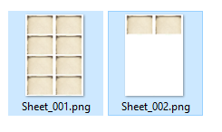

[Back to the main divider page.](/divider)

# General guidelines

Send all picked graphics to any program that can laid them out on paper size then save a merged image for printing. Make sure size of each divider is **physically 93mm x 68mm** on the paper (1098x804 px at 300 DPI). Some programs like to offer scaling to fit. **Make sure that is off**. If using A4 paper, it helps if you pick multiple of 8 dividers to not waste the paper.

If you send the files to print shop they should be able to understand that. If you are doing it on your own, these examples might help.

# Examples

## macOS : Using Photos app

- Open "Photos" program.
- Drag 1 divider folder to it to import all images inside.
- Highlight all images you just imported.
- Press `Cmd + P` to bring up print dialog.
- Setup like in the image : A4, Color, Aspect Ratio : Custom, Photo Size : 93 x 68 mm. Then press Print.
- The next dialog, do not press Print, but press the dropdown saying "PDF" then select the "PDF" choice to save a file out of it instead.
- After it finished saving PDF, you can now go back and press delete to remove the highlighted images. If there are more than 8 images, the produced PDF will be multi-page.

Note : If you don't have any printer installed in the list, the page may not fit 8 dividers like shown because the system assume a default value of paper's edge to reserve. The information that the printer can print closer to the edge of paper comes differently depending on printer, so try installing or choosing different printer if you cannot do it.

## Windows : Using IrfanView app

I can't believe it is so difficult on Windows 10 to do this!! The new Photos app has only paper size adjustment but not the size of individual image. "Restoring" the old Windows Photo Viewer via Registry Editor also similarly lacks control. Paint, Paint .NET, GIMP requires manually laying out each image on the page.

The only good solution I found is this external program [IrfanView](https://www.irfanview.com/).

- Download and install [IrfanView](https://www.irfanview.com/). This program is extremely small but really capable.
- On Desktop, execute "IrfanView 64 Thumbnails" shortcut (Not the regular "IrfanView 64").

  

- Go to where your dividers are and highlight all you want to print. For example, I want to print these 10 images. (Can overflow 8, and can be any number not just multiple of 8. So you are free to mix just dividers you want from different folders.)
- File > **Create contact sheet from selected files...**

  

- Setup like this : 
  - Press A4 button.
  - Set DPI to 300 and Portrait.
  - 2 Columns, 4 Rows to get 8 dividers in one page.
  - **Do not tick** that stretch checkbox.
  - I think you can leave spacing and margin at 30 pixels.
  
    But, depending on how tight on the edge your printer can perform, you may want to increase the margin. But beware that if margin is too large, **it will start shrinking images** to honor that margin and required columns and rows per page.
	
    On 300 DPI A4, size is 3508 x 2480. One divider is 1098 x 804. So on portrait A4 with 2 columns and 4 rows, remaining horizontal space is `2480 - (1098 * 2) = 284` and remaining vertical space is `3508 - (804 * 4) = 292`. Therefore, max margin before shrinking occurs is horizontal 142 and vertical 146, which when combined with spacings both 0, all dividers will stick tightly together at the center. (You may want to purposefully do this to reduce number of cuts, but missed cut will eat into the graphic of the other divider.)

  - On the Output section, use "Save all pages as files". Select destination and choose **PNG** as the format. PDF is there but I believe requires installing a plugin from this program's homepage, so PNG should be easier.
  - Press "Create" and check the output files. More than 8 files should overflow correctly to more sheets. Check one last time if they are all at size 3508 x 2480 or not. (If not, you may forgot to specify 300 DPI earlier.)

    

# Finishing touch

You may use rounded corner punch on them and maybe sleeve to make them last longer.

The printed size 93mm x 68mm can fit inside KMC Character Sleeve just right. The trick to get it in is using the corner of divider or small ruler to stretch open up the 2 entry corners of the sleeve a bit. If you can get both corners in at the same time, the rest will be easy.