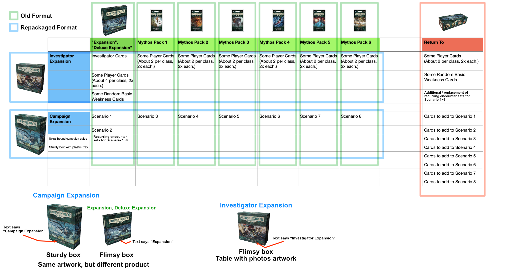

# Explore Investigator Expansions

Page at `/explore/[pack-code-name]` are special case of the `/explore` page. (See documentation of the regular Explore page for details.) It is focused in viewing content of repackaged **Investigator Expansion** box.

The reason I made this :

- From The Scarlet Keys onwards FFG seems to remove the QR Code to view the content inside behind the box. (Edge of the Earth Investigator Expansion was the last one with it.) I want to restore that sort of feature with these pages.
- For the repackaged box like The Dunwich Legacy Investigator Expansion, old QR code works, but still only showing the content of old distribution format. (Mythos Pack must be viewed one by one, and you would get spoiled the campaign cards!)
- arkhamdb.com is stuck with legacy format with separated Mythos Pack blister boxes. Though that site could view by cycle, I want it to be less confusing by eliminating Mythos Packs names altogether and having only "Investigator Expansion" wording. (e.g. There is no longer a card coming from "The Essex County Express".)
- Often I see players obtaining the game second hand and wanted to check for lost cards, this page should help doing so by also displaying collector's number and **quantity** of each card. Each row **can be toggled** for the purpose of counting cards as well.
- It can group in multiple layers, then sort in multiple layers. This may benefit players just purchased the box and wanted to sort differently from what the box gives you.
- Use it to get some ideas to build decks or selecting an investigator focusing on one expansion box, by roughly looking at all the cards.
- Use grouping and sorting to explore the bias of the expansion. (e.g. Whether it has a lot of level 0 cards or not.)
- It is quite mobile friendly.

All other advantages of regular Explore page remains, such as showing full scans by default.

## Collector's Number of repackaged Investigator Expansion boxes



All cycles before Edge of the Earth are repackaged in new format. But to not make old time fans mad, they cannot change the collector's number of each card. (Number at the bottom right.)

They **used to** sell "Deluxe Expansion" box (comes with 2 scenario) + 6 Mythos Pack per one cycle, making full 8 scenario campaign. Player cards can be found sprinkled in every of these boxes instead of jam packaed in one Investigator Expansion box like today.

Let's see how the collector number connects in The Dunwich Legacy.

Deluxe Expansion :

```
Investigtor Cards (1 -> 15)
Player Cards (16 -> 36)
Basic Weakness Cards (37 -> 39)
Campaign Cards (Scenario 1 + 2) (40 -> 104)
```

Mythos Pack #1 ~ #6 :

```
Player Cards (105 -> 117)
Campaign Cards (Scenario 3) (118 -> 146)

Player Cards (147 -> 158)
Campaign Cards (Scenario 4) (159 -> 183)

...
```

If you subscribed in their LCG lifestyle purchasing model, you would get cards increasing in consecutive Collector's Number. Alternating between player cards and campaign cards.

Today with big Investigator Expansion, essentially they just remove the campaign cards that supposed to connecting numbers together. The result is this disconnecting collector's number.

```
Investigtor Cards (1 -> 15)
Player Cards (16 -> 36)
Basic Weakness Cards (37 -> 39)
Player Cards (105 -> 117)
Player Cards (147 -> 158)
...
```

In the Campaign Expansion box, of course you would get :

```
Campaign Cards (Scenario 1 + 2) (40 -> 104)
Campaign Cards (Scenario 3) (118 -> 146)
Campaign Cards (Scenario 4) (159 -> 183)
...
```

By the way, ordering of physical cards came out of Investigator Expansion box are not ordered exactly like that. Player cards used to have 6 classes in order in **each** chunk of Player Cards. Now that they are jumbled together, they re-sort everything to be ordered by class again. You will see beautiful contiguous chunk of colors coming out of the box, but the collector's number looks very jumpy.

The default sorting of **Group by Class, then sort by Number** this page uses corresponds to new Investigator Expansion model. If you change it to **Group by (nothing), then sort by Number** you would get a result similar to old distribution model, minus the campaign cards.

## Official QR Codes

If you prefer, these are all the a QR codes on the back of product box that would reveal all the cards in it. Beware that old distribution format would **spoil the campaign cards** coming together with the player cards, as explained in the previous section.

- [Core Set](http://ffgapp.com/qr/AHC01)
- [The Dunwich Legacy](http://ffgapp.com/qr/AHC02)
- [The Dunwich Legacy : The Miskatonic Museum](http://ffgapp.com/qr/AHC03)
- [The Dunwich Legacy : The Essex County Express](http://ffgapp.com/qr/AHC04)
- [The Dunwich Legacy : Blood on the Altar](http://ffgapp.com/qr/AHC05)
- [The Dunwich Legacy : Undimensioned and Unseen](http://ffgapp.com/qr/AHC06)
- [The Dunwich Legacy : Where Doom Awaits](http://ffgapp.com/qr/AHC07)
- [The Dunwich Legacy : Lost in Time and Space](http://ffgapp.com/qr/AHC08)
- [The Path to Carcosa : The Path to Carcosa](http://ffgapp.com/qr/AHC11)
- [The Path to Carcosa : Echoes of the Past](http://ffgapp.com/qr/AHC12)
- [The Path to Carcosa : The Unspeakable Oath](http://ffgapp.com/qr/AHC13)
- [The Path to Carcosa : A Phantom of Truth](http://ffgapp.com/qr/AHC14)
- [The Path to Carcosa : The Pallid Mask](http://ffgapp.com/qr/AHC15)
- [The Path to Carcosa : Black Stars Rise](http://ffgapp.com/qr/AHC16)
- [The Path to Carcosa : Dim Carcosa](http://ffgapp.com/qr/AHC17)
- [The Labyrinths of Lunacy](http://ffgapp.com/qr/AHC18)
- [The Forgotten Age](http://ffgapp.com/qr/AHC19)
- [The Forgotten Age : Threads of Fate](http://ffgapp.com/qr/AHC20)
- [The Forgotten Age : The Boundary Beyond](http://ffgapp.com/qr/AHC21)
- [The Forgotten Age : Heart of the Elders](http://ffgapp.com/qr/AHC22)
- [The Forgotten Age : The City of Archives](http://ffgapp.com/qr/AHC23)
- [The Forgotten Age : The Depths of Yoth](http://ffgapp.com/qr/AHC24)
- [The Forgotten Age : Shattered Aeons](http://ffgapp.com/qr/AHC25)
- [Return to the Night of the Zealot](http://ffgapp.com/qr/AHC26)
- [Guardians of the Abyss](http://ffgapp.com/qr/AHC27)
- [Return to the Dunwich Legacy](http://ffgapp.com/qr/AHC28)
- [The Circle Undone](http://ffgapp.com/qr/AHC29)
- [The Circle Undone : The Secret Name](http://ffgapp.com/qr/AHC30)
- [The Circle Undone : The Wages of Sin](http://ffgapp.com/qr/AHC31)
- [The Circle Undone : For the Greater Good](http://ffgapp.com/qr/AHC32)
- [The Circle Undone : Union and Disillusion](http://ffgapp.com/qr/AHC33)
- [The Circle Undone : In the Clutches of Chaos](http://ffgapp.com/qr/AHC34)
- [The Circle Undone : Before the Black Throne](http://ffgapp.com/qr/AHC35)
- [Return to the Path to Carcosa](http://ffgapp.com/qr/AHC36)
- [The Dream-Eaters](http://ffgapp.com/qr/AHC37)
- [The Dream-Eaters : The Search for Kadath](http://ffgapp.com/qr/AHC39)
- [The Dream-Eaters : A Thousand Shapes of Horror](http://ffgapp.com/qr/AHC40)
- [The Dream-Eaters : Dark Side of the Moon](http://ffgapp.com/qr/AHC41)
- [The Dream-Eaters : Point of No Return](http://ffgapp.com/qr/AHC42)
- [The Dream-Eaters : Where the Gods Dwell](http://ffgapp.com/qr/AHC43)
- [The Dream-Eaters : Weaver of the Cosmos](http://ffgapp.com/qr/AHC44)
- [The Blob That Ate Everything](http://ffgapp.com/qr/AHC45)
- [Nathaniel Cho](http://ffgapp.com/qr/AHC47)
- [Harvey Walters](http://ffgapp.com/qr/AHC48)
- [Winifred Habbamock](http://ffgapp.com/qr/AHC49)
- [Jacqueline Fine](http://ffgapp.com/qr/AHC50)
- [Stella Clark](http://ffgapp.com/qr/AHC51)
- [The Innsmouth Conspiracy](http://ffgapp.com/qr/AHC52)
- [The Innsmouth Conspiracy : In Too Deep](http://ffgapp.com/qr/AHC53)
- [The Innsmouth Conspiracy : Devil Reef](http://ffgapp.com/qr/AHC54)
- [The Innsmouth Conspiracy : Horror in High Gear](http://ffgapp.com/qr/AHC55)
- [The Innsmouth Conspiracy : A Light in the Fog](http://ffgapp.com/qr/AHC56)
- [The Innsmouth Conspiracy : The Lair of Dagon](http://ffgapp.com/qr/AHC57)
- [The Innsmouth Conspiracy : Into the Maelstrom](http://ffgapp.com/qr/AHC58)
- [War of the Outer Gods](http://ffgapp.com/qr/AHC59)
- [Revised Core Set](http://ffgapp.com/qr/AHC60)
- [Return to the Circle Undone](http://ffgapp.com/qr/AHC61)
- [Edge of the Earth Investigator Expansion](http://ffgapp.com/qr/AHC63)
- [Edge of the Earth Campaign Expansion](http://ffgapp.com/qr/AHC64)