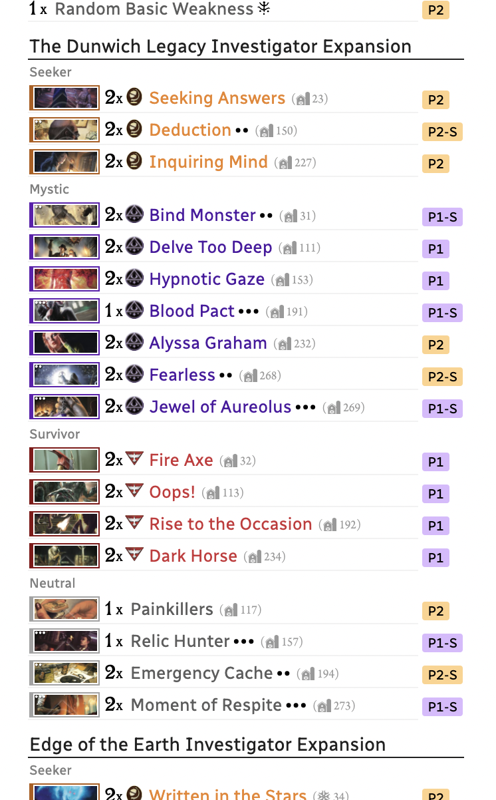
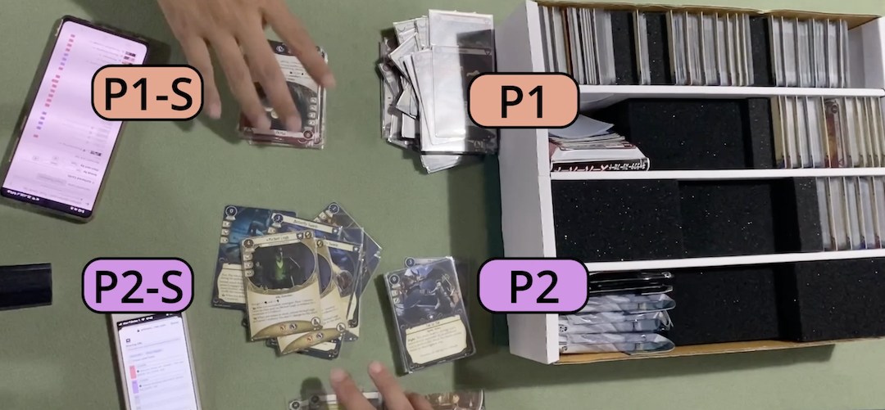
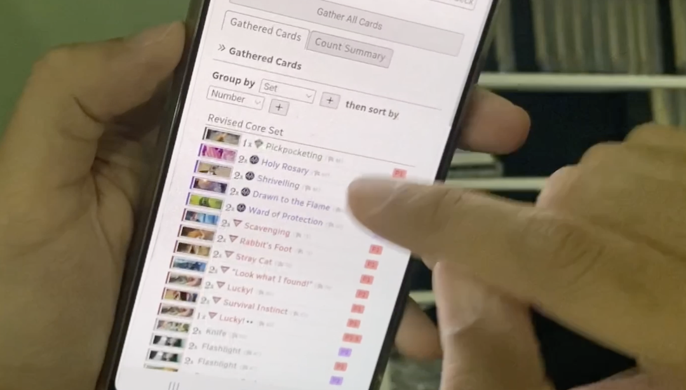
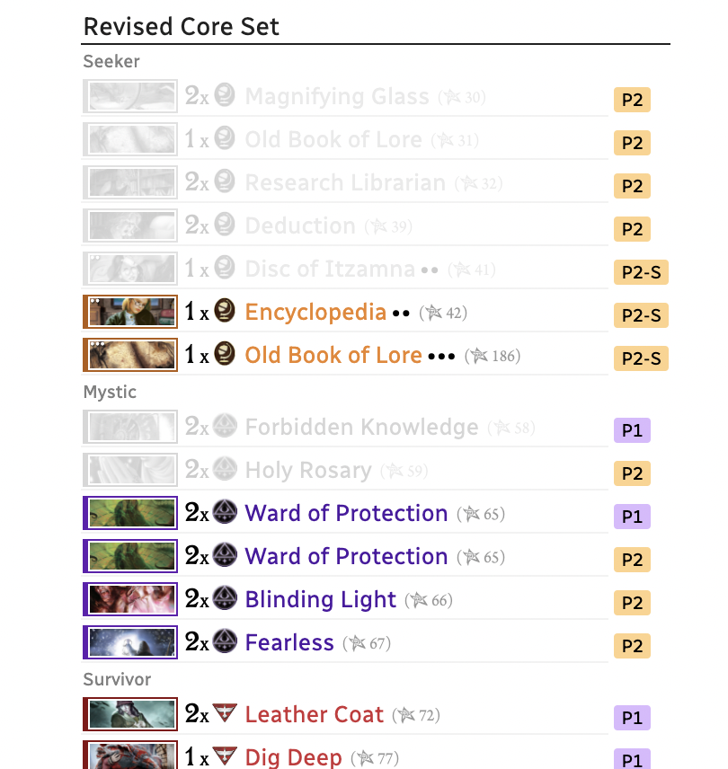
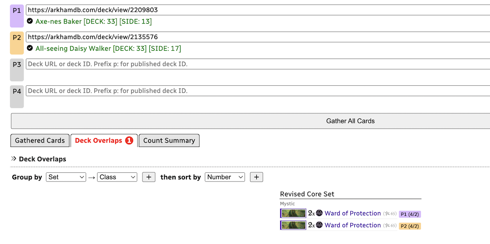
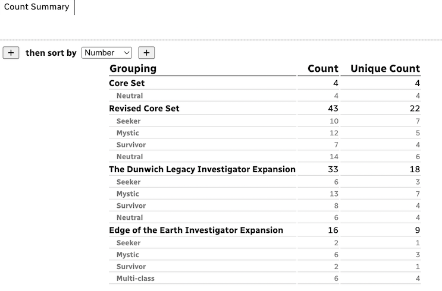

# Deck Gather

This is a tool to help you bring out the cards from your collection for **all players** that had built their own deck in ArkhamDB **in one go**. It does this simply by dumping all the decks together (both starting card list and side deck) into **a single big list**. You can then able to sort everything according to the shape of your collection, and going through everyone's card in a more efficient manner.

You can still tell which entry is for which player by looking at the label appended to each entry, and whether it belongs to that player's side deck or the main deck. (Cards for side decks has `-S` suffix.)

Supposed that you have a party of 2 players, then designate 4 stacks for the main and side deck of each person. Then everyone can help building each other's deck very fast by putting the cards in the right stack as the label told.

This is faster than each player building only their own deck and having to go through the same section in the collection over and over, possibly passing through cards that are to be taken out to an another player's deck.

It is useful if you are the collection's owner where everyone's deck will be built from. You can then gather them for everyone if they are new to the game. Alternatively have an entire table helps working on gathering everyone's deck in parallel if they all know your collection, now that the "tasks" are clearly grouped without conflict.

You should use the "Group by ... then sort by ..." feature as a mean to divide the task, for example you use a binder for one class then you should start by "Class" grouping. If you use a box for one cycle of cards, then you should start by "Set" grouping. If the available groupings or sortings can't cover how you organized your collection, please let me know and I can probably make it happen.

## Decklist transformations

This tool is a part of complete "arkham-starter" website that will have simplified/transformed card entries to suit newcomers to the series, **defying what was actually used** in that deck from the ArkhamDB. This tool is subjected to the same transformations, as follows :

- Any Core Set cards used in the deck is forwarded to Revised Core Set one, if it exists in ArkhamDB as a separated entry.
- Any card from old distribution model will have the pack they came from as "\_\_\_ Investigator Expansion" instead of from a Mythos Pack that was used in ArkhamDB, even if they are not even got repackaged just yet by FFG right now. (e.g. "The Innsmouth Conspiracy Investigator Expansion" mysteriously exists right now in this app.) This helps quite a lot when grouping by Set.
- The latest taboo is on even if the deck didn't specify to use it. It also can force the latest taboo to published deck that was using the previous taboo.

## Importing a deck

You can paste ArkhamDB's deck URL into the box. Other than grabbing the deck ID number from the URL, it also detects a kind of deck from the URL :

- If it has `/decklist/view` or `/decklist/edit` : It requests a deck from published deck API of ArkhamDB.
- If it has `/deck/view` or `/deck/edit` : It requests a deck from personal deck API of ArkhamDB, which **would fail if** that user hadn't check the "make public" option in your user settings. Also if you are currently editing the deck and have changes in the card list, save it first before importing.

You can also type just the deck's ID number, but it always assume it is a personal-but-public deck. To type just deck's ID and you want it to meant published deck, prefix `p:` in front of ID.

### Checking for forgotten cards

After importing, a deck's name will appear under the text box. Along with it a card count for main and side deck. (e.g. `[DECK: 33]`)

After gathered everything, you can count the finished stack against these numbers to check if you have gathered everything correctly or not. Especially that your deck is being assembled with help from everyone in the table, it is more prone to mistakes such as getting 2 copies of a card that you included only 1 copy in the deck.

## Sharing URL

After pressing "Gather All Cards" once, you will also get a URL where the visitor will arrive at this page with decks already in the box and automatically click "Gather All Cards" after arriving.

This is so you can give the URL to other players in the table, then everyone can help out bringing cards from the collection at the same time.

### Mobile usage

This tool is specifically made so a player could work on gathering cards by looking at their mobile phone screen, to go together with this sharing URL feature.

It should be fine to share this URL via messaging apps to each player's personal mobile phone. The card list is intentionally centered and with sufficient line breaking points for viewing on small vertical screen. (It looks quite reasonable on my ancient 4-inch 1st Gen iPhone SE!)

## Grouping and sorting

"Group by ... then sort by ..." horizontal tool section above the cards allows you to shift the result to fit how you organize your collection.

Grouping creates a new list divider, sortings will rearrange the innermost result where there is no more groupings. 3rd grouping onwards no longer receive deeper divider, but it still groups like you specified. Probably better to see it in action how it looks like.

Grouping is useful to divide tasks when gathering the deck, if each group could be worked on independenly per person playing the game.

You can chain groupings and sortings as much as you want by pressing `+` button, it will group and sort in that order from left to right.

Choose "(Remove)" option **inside the dropdown** to delete one layer of grouping or sorting. (There is no good place to add the remove button...) Also you cannot rearrange the order of groupings and sortings. Try removing and adding in the right order instead.

In the future, the Sharing URL should be able to restore grouping and sorting settings as well. For now, anyone opening the URL will start with the default groupings and sortings.

## Toggling a row

When gathering card, sometimes you may got confused which one you had already picked out if they are found in your collection out of order.

To help with this, you can click/touch the row to toggle it like a to-do list. It will fade out, remembering that you had already gathered that card.

## Deck Overlaps Tab

This tab **only appears if** multiple players used the same cards too much it exceeds quantity provided in the collection. It lists everyone that contributes to breaking the limit, and also amount used vs. total quantity of that card suffixed to the label at the end.

The tool assumes you owns 1 box of every release. (There is no Core Set, only 1x Revised Core Set.) You can then may decide to proxy these cards if they are not too many.

This tool currently has no idea about duplicate cards in multiple set, and warn you as soon as it exceeds the quantity inside that set. e.g. Multiple players has "Charisma" that was selected from Dunwich set in ArkhamDB, that it totals to 3 copies, it then warns you even though there is more Charisma in the Revised Core Set to use. For now, please look out for this situation on your own.

It is useful also for playing with "starter deck" that ArkhamDB author have made. These authors may put effort to ensure that 2 decks can play together with minimal clash in the same "series". It is complicated when you starts using 3 or 4 of these decks together, or using it with some of decks in an another series (i.e. Starter deck of investigator from a different cycle.) and the author may not able to exhaustively check for you which is possible to play with which. You can use this tool to check the combination on your own.

## Count Summary Tab

This tab gives you card counts of each grouping layers. It gives 2 kinds of count : Of each physical copy of a card, and count 1 for each unique card.

The use of this tab is when disassembling all player's deck after the end of your campaign. If you combined all the cards according to your desired grouping and matched the count, you have made sure you didn't lost any cards before putting them back into your player card collection.

This inverted the workload, which could be you having to count the used cards combined with the remaining cards in your player card collection. Instead, now you just count a smaller subset of what you took away from the collection.

It parallels to how you count your encounter set before putting back into the collection. You only count that set, you don't count the cards of other scenarios that wasn't used since you made sure they aren't lost the last time you played.

To make the most use of this tab after finished playing, when upgrading cards by transferring from Side Deck to the main deck, also swap the replaced card to the Side Deck, instead of going back to your collection. So that the count adds up to the same number in this page when you finished playing to match what you started with. (e.g. At the end of campaign, your Side Deck would consists of many level 0 cards that was in your starting deck.)