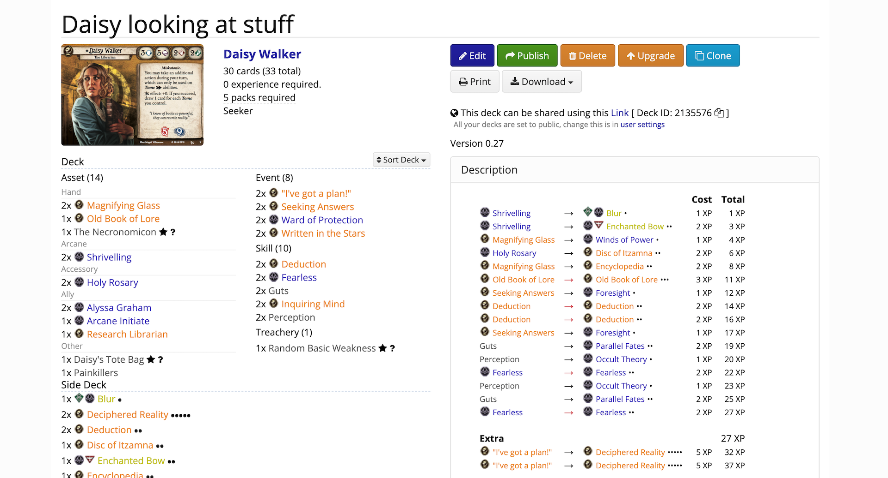

# Upgrade Planner


A two-column table that can "diff" the cards and update XP calculation (cost and total cumulative) as you change things around on the table. The plan is implied that you upgrade in order from top to bottom.

It is designed for decks that uses the main section for level 0 starting cards and Side Deck section for all the upgrade cards. Sometimes you forgot which cards in the starting list are waiting to be removed long after creating it, or you are not sure if all the upgrades you listed in the Side Deck is too XP hungry or not.

By importing that deck, you have every cards needed for both "from" and "to" columns for use in this planner, since ArkhamDB exports both the main and side deck together.

Its primary objective is to test upgrade viability of your deck, then **export** your finished plan to table-formatted Markdown which is a disaster to normally type. Paste this exported Markdown to ArkhamDB's deck guide to remember your upgrade plans for future reference in-between scenarios what you were thinking while creating the deck, and perhaps easier to make some deviations from the plan depending on your campaign state because you see the original outline clearer.



The export formatting try to emulate what is shown on the left section of your deck in ArkhamDB. (With class icons, coloring, XP pips, hoverable, and is even using the same stylesheet as the rest of ArkhamDB.) So if you are writing a detailed deck guide for beginners, they can make visual connection to the decklist better as opposed to being generic blue hyperlinks.

Below are some boring write ups about details of each section you can probably figure out by just using it... I program better when I write documentations first even before anything is completed.

- [Staging Area](#staging-area)
- [Two-column Table](#two-column-table)
  - [Left side](#left-side)
  - [Right side](#right-side)
  - [Arrow](#arrow)
  - [Mark](#mark)
  - [XP Unlock](#xp-unlock)
  - [Divider Row](#divider-row)
  - [Cumulative XP Unlock](#cumulative-xp-unlock)
- [Exporting](#exporting)
  - [Shape](#shape)
  - [Included columns](#included-columns)
  - [Card presentation](#card-presentation)
  - [Export border](#export-border)
  - [Import code](#import-code)

## Staging Area

Section on the left side of the screen. These are cards you are planning to add to the two-column table to try out the upgrades. You may add more cards than actually used in the planner.

It is planned so you can add any individual card as you like, but it need a good card browser which looks like a lot of work. For now, you can only add cards by pasting deck URL from ArkhamDB.

Other than grabbing the deck ID number from the URL, it also detects a kind of deck from the URL :

- If it has `/decklist/view` or `/decklist/edit` : It requests a deck from published deck API of ArkhamDB.
- If it has `/deck/view` or `/deck/edit` : It requests a deck from personal deck API of ArkhamDB, which **would fail if** that user hadn't check the "make public" option in your user settings. Also if you are currently editing the deck and have changes in the card list, save it first before importing.

Use the left/right button to add the card to main two-column table. It will create a new row automatically if it cannot find empty space to add.

It is possible to drag and drop cards here to an empty slot in the two-column table. A card will appear there but will not disappear from the staging list.

## Two-column Table

Any card can move individually by drag-and-dropping. If you drop on an another card, both cards will swap place. Press the trash can button to delete a single card.

An entire row can be moved as a whole using up/down button on the left. A row cannot be dragged. An entire row can be deleted by pressing the trash can button on the left.

### Left side

This side represent a card to be removed.

So if your plan for the step is purchasing a Permanent card, it should be on the right side, not the left. (Otherwise automatic calculation would be wrong.)

### Right side

This side represent a card to add.

### Arrow


If it has a little red tip, that means it detects that a row is an upgrade instead of a purchase and may get XP discount. It detects by comparing card name of both sides if they are the same or not.

### Mark

There is a little box on the left side of the left card for each row. You can type anything here (like an asterisk or other ASCII characters) and it will appear in the final export as its own column.


This is so if you want to say something about this row, it can be paired with later under the table. Markdown support of column span is not good, so it is best not try to add an explanation paragraph sandwiched inside the table.

### XP Unlock

Check the unlock icon at the end of each row to unlock the automatic XP calculation. The XP box is now editable, and is currently using the previously automatically calculated XP. Locking and unlocking again will reset the box to automatically calculated number.

The application has no knowledge of a card like [Adaptable](https://arkhamdb.com/card/02110), [Down the Rabbit Hole](https://arkhamdb.com/card/08059), etc. and this is where you can force it to use any XP as you like.


Cumulative XP will also be updated to use your custom edit XP automatically.

Exceptional cards are already accounted for in the automatic calculations, you don't have to manually type in the doubled amount of XP. (If there is no bug in my calculation coding, hopefully.)


### Divider Row

Press "Add Divider Row" to add a special row. This row can subdivides the table into multiple sections with total cumulative XP connected. Use the up/down button on the left to position the divider row.

I realized that if rows are draggable it would be much better, but it looks like a lot of more work. For now, please try pressing that up/down button repeatedly.

Type on the long box to explain the divider. It is exported in Markdown to the same column as the left card.

### Cumulative XP Unlock


Similar to "XP Unlock" feature, but only available on the divider row. Using unlock check box on the divider row will "interrupt" the flow of cumulative XP to stop here, and start with a new value that you type in.

## Exporting

You will see a chunk of nightmare that you now don't have to type. Highlight them with Ctrl/Cmd+A, copy, then paste into your deck's description in ArkhamDB.

There is only 1 option to adjust right now, which to make divider provides a disconnected table. The columns will stop lining up between tables, but you can now type something in-between.

### Export border

You might notice these :

```md
[//]: # (==================== TABLE START ====================)

...
[//]: # (===================== TABLE END =====================)
```

This is a Markdown comment that viewer cannot see. Since the exported Markdown table looks like a mess, this dividing line helps you see clearer where is the table while scrolling through your deck documentation, so you can detect an actual content that you had hand-typed from the mess.

### Upgrade URL

At the end of your exported Markdown you will see a URL nested inside Markdown comment, like this :

```
[//]: # (https://arkham-starters.com/guide-tools/upgrade?i=EiIaAlhQKgcKA%2BKGkhABMg0KBENvc3SBVRvdG...)
```

Since the table is hell to continue editing in Markdown format, this URL is intended so if you visit it, you would arrive back at this page with the table restored and can continue making changes to make a new export. You can share this so others can use to see the upgrade plan in this site as well.

Only the deck URL in the Staging Area is remembered, not the list of cards imported. This page will re-run the import once you arrive back in this page. Therefore, if you made changes to the deck at the URL's destination, the card list in the Staging Area may be different from before.

You can share this URL somewhere to direct people to view your upgrade plan here instead of rendered in ArkhamDB's Markdown section, for example sharing in a forum post to illustrate your point when talking about upgrading.