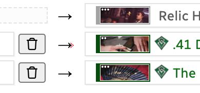
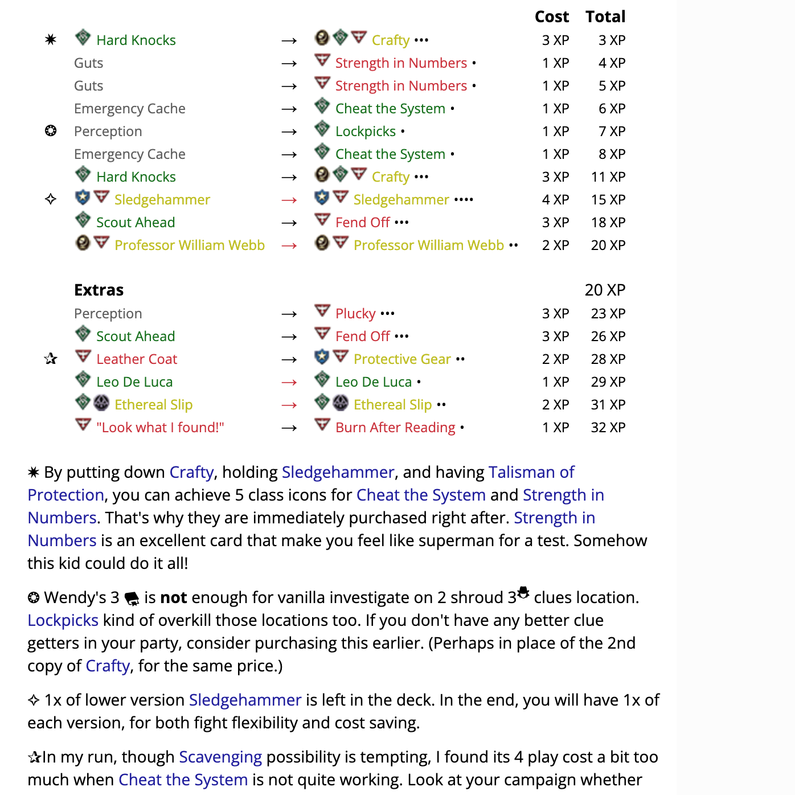
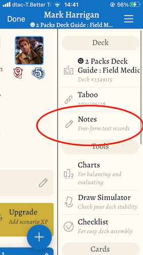

# Upgrade Planner

**Note:** This tool is **not** intended to be mobile-friendly.

A two-column table that can "diff" the cards and update XP calculation (cost and total cumulative) as you change things around on the table. The plan is implied that you upgrade in order from top to bottom.

It is designed for decks that uses the main section for level 0 starting cards and Side Deck section for all the upgrade cards. Sometimes you forgot which cards in the starting list are waiting to be removed long after creating it, or you are not sure if all the upgrades you listed in the Side Deck is too XP hungry or not.

By importing that deck, you have every cards needed for both "from" and "to" columns for use in this planner, since ArkhamDB exports both the main and side deck together.

Its primary objective is to test upgrade viability of your deck, then **export** your finished plan to table-formatted Markdown which is a disaster to normally type. Paste this exported Markdown to ArkhamDB's deck guide to remember your upgrade plans for future reference in-between scenarios what you were thinking while creating the deck, and perhaps easier to make some deviations from the plan depending on your campaign state because you see the original outline clearer.

The export formatting try to emulate what is shown on the left section of your deck in ArkhamDB. (With class icons, coloring, XP pips, hoverable, and is even using the same stylesheet as the rest of ArkhamDB.) So if you are writing a detailed deck guide for beginners, they can make visual connection to the decklist better as opposed to being generic blue hyperlinks.

Below are some boring write ups about details of each section you can probably figure out by just using it... I program better when I write documentations first even before anything is completed.

- [Staging Area](#staging-area)
- [Two-column Table](#two-column-table)
  - [Left side](#left-side)
  - [Right side](#right-side)
  - [Arrow](#arrow)
  - [Mark](#mark)
  - [XP Unlock](#xp-unlock)
  - [Divider Row](#divider-row)
  - [Cumulative XP Unlock](#cumulative-xp-unlock)
- [Exporting](#exporting)
  - [Shape](#shape)
  - [Included columns](#included-columns)
  - [Card presentation](#card-presentation)
  - [Export border](#export-border)
  - [Import code](#import-code)

## Staging Area

Section on the left side of the screen. These are cards you are planning to add to the two-column table to try out the upgrades. You may add more cards than actually used in the planner.

It is planned so you can add any individual card as you like, but it need a good card browser which looks like a lot of work. For now, you can only add cards by pasting deck URL from ArkhamDB.

Use the left/right button to add the card to main two-column table. It will create a new row automatically if it cannot find empty space to add.

It is possible to drag and drop cards here to an empty slot in the two-column table. A card will appear there but will not disappear from the staging list.

### Importing a deck

You can paste ArkhamDB's deck URL into the box. Other than grabbing the deck ID number from the URL, it also detects a kind of deck from the URL :

- If it has `/decklist/view` or `/decklist/edit` : It requests a deck from published deck API of ArkhamDB.
- If it has `/deck/view` or `/deck/edit` : It requests a deck from personal deck API of ArkhamDB, which **would fail if** that user hadn't check the "make public" option in your user settings. Also if you are currently editing the deck and have changes in the card list, save it first before importing.

You can also type just the deck's ID number, but it always assume it is a personal-but-public deck. To type just deck's ID and you want it to meant published deck, prefix `p:` in front of ID.

## Two-column Table

Any card can move individually by drag-and-dropping. If you drop on an another card, both cards will swap place. Press the trash can button to delete a single card.

An entire row can be moved by dragging the handle on the leftmost of each row. When dragging, a destination line will show where would it be dropped to. If you dropped and the line does not disappear, that is a bug. Please grab the handle and drop again to make it disappear. (Or else card dragging may stop working temporarily.)

An entire row can be deleted by pressing the trash can button on the left.

### Left side

This side represent a card to be removed.

So if your plan for the step is purchasing a Permanent card, it should be on the right side, not the left. (Otherwise automatic calculation would be wrong.)

### Right side

This side represent a card to add.

### Arrow

If it has a little red tip, that means it detects that a row is an upgrade instead of a purchase and may get XP discount. It detects by comparing card name of both sides if they are the same or not, and that the right side's XP is higher than the left.

### Mark

There is a little box on the left side of the left card for each row. You can type anything here (like an asterisk or other ASCII characters) and it will appear in the final export as its own column.

This is so if you want to say something about this row, it can be paired with later under the table. Markdown support of column span is not good, so it is best not try to add an explanation paragraph sandwiched inside the table.

### XP Unlock

Check the unlock icon at the end of each row to unlock the automatic XP calculation. The XP box is now editable, and is currently using the previously automatically calculated XP. Locking and unlocking again will reset the box to automatically calculated number.

The application has no knowledge of a card like [Adaptable](https://arkhamdb.com/card/02110), [Down the Rabbit Hole](https://arkhamdb.com/card/08059), etc. and this is where you can force it to use any XP as you like. You can use it together with the "Mark" feature so reader knows whats going on differently with these rows you edited the XP. (Like here I use "-1" to hint the reader that it is cheaper than usual.)

Cumulative XP will also be updated to use your custom edit XP automatically.

Exceptional cards are already accounted for in the automatic calculations, you don't have to manually type in the doubled amount of XP. (If there is no bug in my calculation coding, hopefully.)

### Divider Row

Press "Add Divider Row" to add a special row. This row can subdivides the table into multiple sections with total cumulative XP connected. This row also have the drag handle.

Type on the long box to explain the divider. It is exported in Markdown to the same column as the left card.

### Cumulative XP Unlock

Similar to "XP Unlock" feature, but only available on the divider row. Using unlock check box on the divider row will "interrupt" the flow of cumulative XP to stop here, and start with a new value that you type in.

## Use Latest Taboo

Use this checkbox to use or not use the latest taboo. It affects XP calculation for chained / unchained cards, and also some cards gain Exceptional keyword in the taboo.

## Export

This tool exports 3 things :

### Text

Choose the export format to match your destination.

#### Format : ArkhamDB

ArkhamDB format is designed to paste in Description section of your deck, and it make use of ArkhamDB's CSS styling. If you paste this string somewhere else (even if Markdown is supported, such as Reddit or Discord) you would just see a big mess.

Markdown table is supported here. Combined with CSS coloring, we can get very pretty result. The settings allow you to include a link for viewers to come view the upgrade plan in this site as well. Which maybe more mobile friendly, and the viewer can also continue adjusting your plan further. You can also use this link yourself to make edits to your previous upgrade plan.

#### Format : ArkhamCards

ArkhamCards has a deck viewer, where if you touch the hamburger menu button on the top right corner and select "Notes", it can show the deck's Description section in ArkhamDB. It support card hot-linking in the same syntax as ArkhamDB as well.

However, Markdown supported in ArkhamCards is not as extensive as ArkhamDB, and CSS coloring is not supported as well, naturally. This export option removes the Markdown table formatting and adjust stuff to be simpler. This is how it looks like in arkhamdb.com :

Which may look less nicer since it does not have tabulated column formatting anymore, but in return, you can see it in ArkhamCards! While not colored, the class icons and pips added could help identifying the cards. Hyperlinks also works nicely as well, try tapping it.

Remember that if you clone a deck to be included in ArkhamCards campaign, it loses all the Description text. You have to paste the Upgrade Planner snippets again in the deck in your ArkhamCards campaign.

### Data Code

All the work you done in this page are compressed into this messy string. Data Code will have some use in the full arkham-starter.com so you can tie upgrades with any deck. For now, this has no use.

### Link

Use this link to come back to this page with all the work preserved. You can use this to share upgrade plans to others where pasting the export text is not possible, but browser usage is possible.

You will notice that the link contains the Data Code above.

